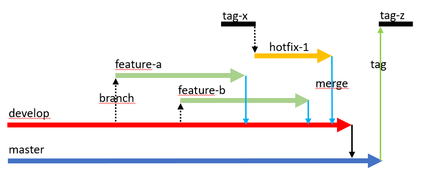
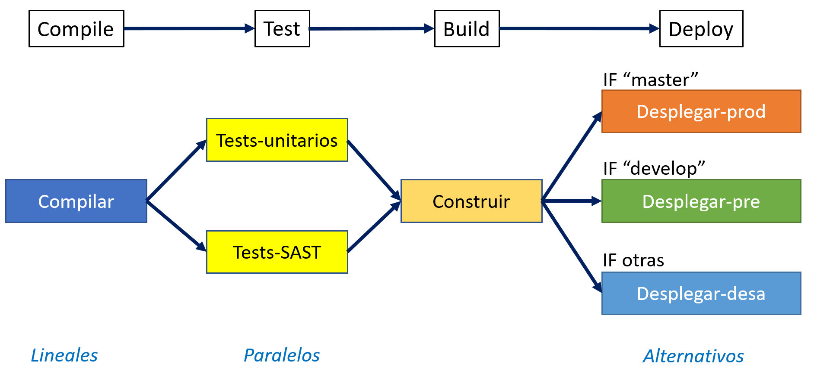
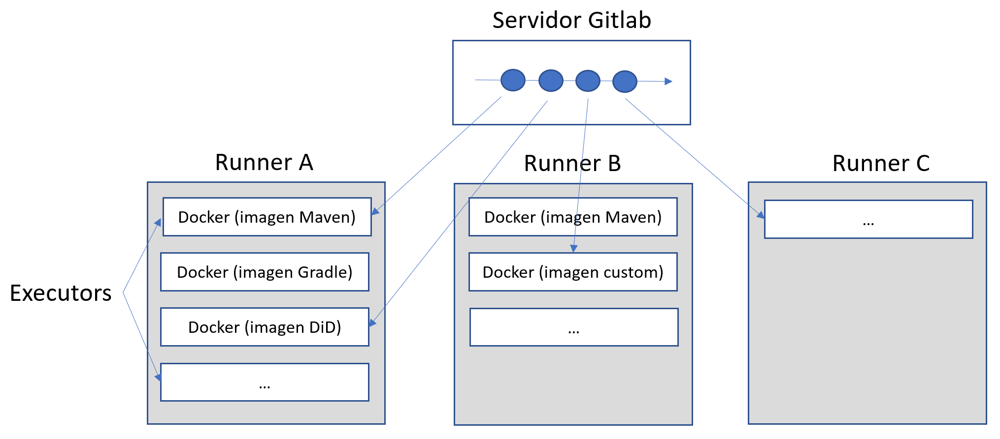
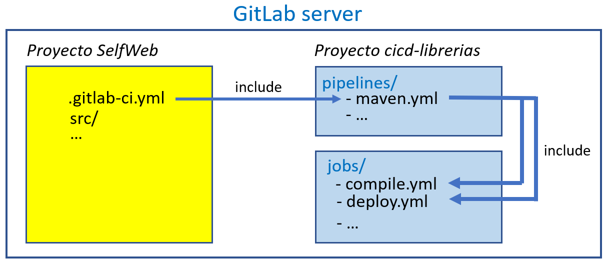
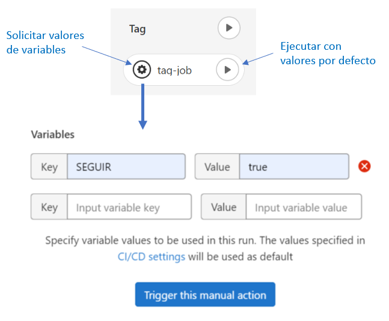

=  &nbsp;&nbsp;&nbsp; Project _cicd-librerias_
Faustino Nebrera <faustino.nebrera@vass.es>
1.0.3, 14/12/2022
:toc:
:toc-title: Index
:toclevels: 4
:sectnumlevels: 4
:icons: font

== Abstract

This project represents a fully operational example of a CI/CD chain built with the idea of simplifying the DevOps stack, the installation of required products and, above all, the preparation of pipelines and jobs for the most usual circuits. It is not intended to make product comparisons and, even less, to establish a strict guideline of how to do things, as each company and/or IT department has its own rules and regulations. For this reason, the libraries are
very flexible, and can be adapted with very little work to different regulations and procedures. 

Current version is specific to maven/java projects deployed as Docker stacks. Provisioning is
quite generic and is based on Terraform. For deploy, we have chosen to use bash and ssh, thinking in not too complex environments.

In later versions, we plan to replicate part of the libraries to include projects based on phyton, node.js, .Net.core, etc. It is also planned to incorporate the possibility of using some sophisticated deploy product, such as Ansible, Octopus, etc. Finally, work will be done on the provisioning and deployment of projects based on microservices (kubernetes, swarm, etc.).
 
== Versions

[cols=".<1,.<1,.<1,.<6", options="header"]
|===
|Vers
|By
|Date
|Notes

|1.0.0
|FNG
|22/08/2022
|First version for maven/java

|1.0.1
|FNG
|25/09/2022
|Added provisioning with Terraform and a generalized deploy using bash, sftp & ssh

|1.0.2
|FNG
|03/11/2022
|New facility for handling function libraries. New standar method to pass dynamic info from provisioning to deploy

|1.0.3
|FNG
|14/12/2022
|Documentation is now in english. New fully tested examples of provision/deploy: Currently available for Hyper-V, AWS & Vmware vSphere(TM)
|===

:sectnums:
== Introduction

The most common CI/CD stacks are composed of several products, each specialised in a particular aspect of the final solution pipeline.
It is very common to find stacks that include 6 or more different products: Gitlab, Jenkins, Sonar, Nexus, Vault, Octopus, etc.

It is clear that installing (and especially configuring) many heterogeneous products is not a trivial job. Some vendors
allow this task to be simplified by pre-integrated solutions (e.g. RedHat OpenShift, CI/CD services from Amazon Web Services or Azure, etc.), but of course these are not simple black-boxes, as each organisation
has its own CI/CD requirements. A small ISV is not the same as a large Financial Institution, which is why it is always necessary to
tinkering with the default configurations, or even creating them from scratch.

On the other hand, the _Jenkins(TM)_ type task coordinators are configured using a programming language that, although simple, requires DevOps engineers to have some
programming skills and familiarity with the language in question. If, in addition (and this is the norm), the code must be
kept read-only for the developers, and it must be modular (using libraries), so the learning curve is usually expensive.

In this project we have tried to minimise:

- The number of products involved.
- The complexity of defining task flows (pipelines).

For this purpose, some of the CI/CD capabilities offered by Gitlab in its latest versions have been used, and some example
pipelines have been defined and tested in a real environment, with quite satisfactory results.

[TIP]
.*Important*
--
Regardless of your previous CI/CD background, you may find it useful to read this document in order to reinforce
basic concepts and understand the philosophy of CI/CD pipelines.
--

== Developer's environment

=== Base Hardware & software

Server for Hyper-V::
* AMD Ryzen 7 5700G (8 cores, 16 threads).
* 64 GB Memory
* 1 TB SSD
* Windows Server 2022 Standard
* Hyper-V

Server for Vmware::
* Intel i7 7567U (4 cores, 4 threads).
* 32 GB Memory
* 256 GB SSD + 256 GB HD
* ESXi 8.0
* vCencer server 8.0

Server for CI/CD::
* Virtual machine on Hyper-V.
* 24 GB Memory max.
* 4 virtual processors.
* Ubuntu 22.04.1
* Docker 20.10.17 & docker-compose

Provisioned VMs::
* 2 GB Memory.
* 2 virtual processors.
* Alpine Linux 3.16.2 (Hyper-V). Amazon linux 2 (AWS). Debian bullseye 11.5 (Vmware)
* Docker 20.10.17 & docker-compose.
* Basic tools: OpenSSH-server, bash, sudo, etc.

=== CI/CD products

All products have been installed on the CI/CD server as docker images, and are launched via docker-compose, to make it easier to start/stop a particular product without affecting the rest. All docker-compose,s refer to a common bridge network.
By sharing the network, communication between containers is facilitated, since Docker acts as an internal DNS.
Except in the case of Nginx, no TCP/IP ports are exposed to the outside. External access is
channeled through Nginx (port 443), which acts as a reverse proxy, discriminating access based on the destination hostname. The
products installed are:

- Gitlab OMNIBUS 15.2.1-ce.0
- Gitlab-runner: latest
- Sonarqube 9.6.1-community
- PostgreSQL 14.4 (used by Sonar & Selfweb)
- Nginx 1.21.6 (reverse proxy)
- Portainer ce:2.15.1 (Docker monitoring)

== Solution overview

=== Working projects

Pipeline and job libraries are located in the "cicd-libraries" project, and will be described in more detail later. Both the libraries and the documentation are available in a public repository (github).

For a live working project, the Comunytek Selfweb application has been chosen, and specifically the REST server (selfwebspingboot). It is a java application that uses the SpringBoot framework. Maven is used as project manager. In the "cfg_examples"
folder you can see the pom.xml of this project, as well as other examples of configuration files.

=== Continuous integration model

The simplified "Git Flow" model has been chosen as the standard. While pipelines can easily be adapted to other models, this is the one preferred by many organisations, and the one currently used in the Comunytek Clan projects. The model works as follows:

- There must be a "master" branch, which is also the default branch. This branch must contain the code of the latest version released for production, or in the process of being released. The branch is protected so that only mantainers can do merge and push.
- There must be a "develop" branch. This branch must contain the code of the latest version released for pre-production, UAT, Staging, etc. or in the process of being released. The branch is protected so that only mantainers can do merge and push.
- Development is carried out on auxiliary branches, associated with all the development work prior to pre-deployment: to a feature, a developer, etc. Developers work locally on their branch and periodically push it for backup purposes, which can optionally trigger a CI/CD pipeline.
- As the development work on the different branches is completed,
they are unified by merge on a temporary branch (e.g. "desa-5.0.9-sprint-34") where possible inconsistencies are checked, integration and EndToEnd tests are carried out, etc.
- Once the temporary development branch is complete, a mantainer will merge locally over develop, resolve any last-minute inconsistencies and push develop, which will trigger a CI/CD pipeline associated with pre-production.
- When a SNAPSHOT is authorised for production, a "Mantainer" will do a local merge of 'develop' over 'master',
will modify the version in the pom (removing the string "SNAPSHOT"), and do master push, which will trigger a CI/CD pipeline associated to production. 
- Hotfix branches may exist, but no more than one at a time. As we will see later, this branch (if it exists) has special treatment.

=== Gitlab as a CI/CD environment

The latest versions of Gitlab incorporate a set of features that make it a good candidate to support the bulk of CI/CD chains in an integrated way. In the following sections we will discuss this subject in detail.

==== Source code repository

Git/Gitlab are the de-facto standard for source code management. We will not go into the details of Git, being it a well known fellow of every developer. However, there are some lesser-known features
that are worth mentioning.

- Gitlab includes a simple but quite complete *Issue Manager*, which, in some cases, can be used as a substitute for _Jira_(TM).
- It also includes a *Wiki* with support for several markup languages which, as in the previous case, can be used as a replacement for _Confluence_(TM), at least in terms of project documentation.

==== CI/CD Coordinator

Gitlab includes a relatively less-known CI/CD coordinator, whose capabilities have traditionally been despised in front of mainstream products, such as _Jenkins_(TM) or _TeamCity_(TM). In its latest versions, however, Gitlab has positioned itself as a serious competitor, mainly because of the following reasons:

* All CI/CD plumbing is tightly integrated with the source code repository, uses the same user interface,
and simplifies the eventual integration of other products.

* Pipelines are defined using a well-known markup language (yaml), avoiding the need of learning a specific language.

* Whenever complex actions are required, the shell environment is directly integrated with the job code. It is also very easy to create function libraries written in .sh, .bash, etc. and call them directly from a job. DevOps engineers can concentrate on creating the basis of the pipelines, leaving certain implementation details of each job to specialised developers.

==== Code Quality Control

Gitlab does not have a propietary solution for this subject. Instead, it proposes the use of the _CodeClimate(TM)_ product. Integration is currently in Beta phase. As far as the de facto standard for this phase has been, for years, _SonarQube(TM)_, which is also easily integrated with the most common project managers (maven, gradle, npm...), we have preferred to integrate said product in this example. The process is explained in detail later on.

==== Unit tests

Again, Gitab relies on third-party solutions for both unit testing and SAST execution. In our case, we will use the capabilities embedded in _maven_, which are more than sufficient in most projects.

==== Artifacts Building

Most project managers (_maven_, _gradle_, _npm_...) have their own mechanisms for detecting dependencies and building the final artifact(s). In this project we have relied on the capabilities of _maven_, as we will see later. Adapting the jobs to other environments is quite simple.

==== Artifacts Registry

In this aspect, the market is clearly dominated by two key players: _Nexus(TM)_ and _Artifactory(TM)_. Gitlab, however, provides a "Package Registry" compatible with most common formats, and with basic functionalities, which we think may be sufficient in many cases. For this reason, we have relied on Gitlab itself in this section.

==== Docker Image Registry

Gitlab provides a very flexible "Component Registry", so we have selected using it in this example. Note that Nexus, for example, incorporates this functionality as a separate product, not included in the Nexus Registry, which goes against our idea of simplicity.

==== Provisioning

For this subject, Gitlab propose the usage of docker images with Git + Terraform, facilitating the integration of _Terraform(TM)_ into gitlab pipelines. The aforementioned images include an integration library with 'gitlab-terraform xxxx' commands. We do not recommend the use of this library, as it adds little features and is somewhat cumbersome. Therefore, an ad-hoc docker image has been created based on a minimal linux (Alpine), and Terraform's native commands are used.

A very interesting aspect is that Gitlab can act as a backend to the Terraform status of the project, thus preventing simultaneous access from causing unwanted behaviour. 

==== Deployment

For this first version, deployment of the generated Docker image is done in a relatively simple way (using bash, sftp and ssh).
Gitlab can integrate different auxiliary platforms such as Helmet/Kubernetes, Ansible, etc., so later versions of this project will explore these possibilities. 

=== Gitlab CI/CD first steps

Obviously, it is not the purpose of this document explaining in detail how to work with Gitlab CI/CD, but it is interesting to comment on the main aspects.

- The first thing that surprises when approaching Gitlab CI/CD is that there is a *single* pipeline definition file per project. This file must be located at the root of the project, and must be named ".gitlab-ci.yml". The
file format is yaml, with fairly easy to learn keywords.
- Notwithstanding the above, this .yml can contain includes from other .yml file(s), which in turn can have includes, and so on.
In addition, includes can reference another project, so it is easy to set up a specific project to store these includes,
as is the case in this example.
- The pipeline is composed of stages, and job definitions associated to the different stages. There can be more than one job associated to a stage, either to be executed in parallel or just one of them depending on the values of certain variables.

- There are two optional predefined stages, called ".pre" and ".post". The jobs defined for these stages will always be executed before (after) the rest of the stages.
- In each job, rules are defined to include or not this job in the pipeline, and under which execution conditions. For example, a "manual" job will be blocked in the pipeline until it is triggered by a Mantainer.
- When a CI/CD event is triggered, Gitlab parses all the rules and dynamically assembles a pipeline containing only the jobs where the rules are met. This allows us to have "n" different pipelines, each one associated to a set of rules. As you can see, this is a very different way of working as compared to _Jenkins(TM)_ or _Artifactory(TM)_.
- Using rules, we can define whether or not do we allow the job to fail and, consequently, the pipeline to continue. For example, in a job running Sonar, we allow it to fail in the "develop" branch, as it is not a release to production.
- We can include a "before_script" and an "after_script" in the job, in addition to the main script. For example, we can define an after_script that should be executed only if the job fails, to rollout or prepare for a later phase.
- In gitlab we must have one or more runners that manage the execution of the jobs, launching a specific executor for each one. In this example, we have configured a Docker runner, which runs as a separate Gitlab container. This runner, in turn, and for each job assigned to it, creates a Docker container with the image indicated in the job itself, and it is in this container where the scripts are executed. Scripts are written in the shell language associated with the docker image, i.e., "sh", "bash", "PowerShell", etc.

- For this example we have prepared an executor image called "ck-maven-executor", based on a lightweight linux distro (Alpine) on which maven, git and other utility modules are pre-installed. This way, we "save" all the time required to install these components every time we run a job. Additionally, another executor image called "ck-terraform-executor" has been prepared, also based on Alpine and with Terraform pre-installed. The directory "ejemplos_cfg/executors" contains
the Dockerfiles and shell scripts used to build these images.
- Gitlab has several mechanisms to "pass" information from one job to another. Possibly the most widely used is the "cache", in which we can include one or more working directories that each job "reads" at startup and "writes" at the end. A typical example of use is the maven dependency repository. If a required item
it is in cache, they will be downloaded only once and will be available to the different jobs later on.
- A key element in the definition of the pipeline are the "variables". In Gitlab, there are several levels of variables:
* Gitlab predefined variables: They all start with "CI_" and can contain both static and dynamic information. For example, CI_PROJECT_ID
contains the project Id (static), while CI_COMMIT_REF_NAME contains the name of the branch the pipeline is working on (dynamic).
* Group Variables: These are defined in the project group configuration. They can be masked, so that they are not visible in logs (e.g. passwords). As they are associated to the group, only "Mantainer" level users in the group have the right to view and modify them. Although this is a fairly simple mechanism, it allows us to avoid the need of a secrets manager (e.g. Vault) in the CI/CD phases.
* Project Variables: Similar to the previous ones, but project specific.
* Pipeline Variables: These are associated with the project pipeline and are modifiable by both Mantainers and Developers. They can be defined in any of the includes, or in the main .yml.
* Job Variables: These are specific to each job, and are valid only during the execution of that job.
* Environment Variables: Specific to each script. These are normally job variables, although it is possible to pass them to subsequent jobs using the "dotenv" artifact passing mechanism discussed later.
- The pipeline is triggered when certain events occur (commit, push, merge_request). Both at pipeline level and individually per job we can "filter" the events we are interested in. In this example, in the rules at pipeline level we have defined that we are only interested in "push" events.
- Gitlab has many other mechanisms (multi-project pipelines, external triggers, webhooks, etc.) that have not been necessary in this example, so we do not go into their description. 

== Library description

In this first version of the project, we use only three products: Gitlab, SonarQube and Terraform. This contrasts with the 4, 5 or 6 products that are commonly used in CI/CD chains. These three products are also very familiar to DevOps engineers and developers alike.

The project also demonstrates that Gitlab CI/CD can perfectly replace Jenkins or TeamCity, and with a very simple pipeline definition language and a fast learning curve.

=== Layout

A Git project called "cicd-libraries" has been created within the "comunytek" project group. In this group also lives the project "selfwebspringboot" which we will use as an example of the implementation of the libraries.

- 3 folders have been created in _cicd-libraries_:

* ejemplos_cfg: Includes examples of configurations in the base projects, such as ".gitlab-ci.yml", "pom.xml", etc.
* pipelines: Contains the main includes for the different environments. In the current version only those used for maven/java are defined.
* jobs: Contains a folder for each environment (in this example, only maven), and in each folder, the includes for each job in the pipeline.

- In _selfwebspringboot_ the file ".gitlab-ci.yml" has been created, as an example of integration of the _cicd-libraries_ libraries.

This is be the basic scheme for the use of libraries:

=== Variables

==== Group level

At project group level the following variables have to be defined:

CICD_USER:: Gitlab user with sufficient rights to call the Gitlab API in relation to the project. Normally this will be a Mantainer.
CICD_PASSWD:: Password for user.
CICD_TOKEN:: Personal token created for the previous user (in user settings).
CICD_EMAIL:: Email address of the user.
CICD_HOST:: Gitlab server hostname (e.g. "git2.comunytek.com").
CICD_REGISTRY_HOST:: Hostname of docker registry. Even if hosted in the same Gitlab server, it listens a different port,
so we have to discriminate it by host name (e.g. "https://registry2.comunytek.com"). Set to 'dockerhub' if using public docker repository.
SONAR_HOST_URL:: Full URL of Sonarqube host (e.g. "https://sonar2.comunytek.com").
SONAR_HOST_TOKEN:: Token generated in Sonar for external access via API.

==== Pipeline level (hidden)

In the main include of the pipeline, a set of variables are defined that are hidden from the Developers, and are used as the basis for implementing the different flows. A Group Manager can modify the behaviour of the pipeline just changing these variables.

IGNORE_AUX_BRANCHES:: Pipeline is not executed in auxiliary branches (those different of 'master' y 'develop').
If "true", the rest of flags related to auxiliary branches are ignored.
Note that the branch identified as HOTFIX_BRANCH (in case it exists) is not considered auxiliary.
COMPILE_AUX_BRANCHES:: Flag to compile aux branches.
SONAR_AUX_BRANCHES:: Flag to launch Sonar analysis in aux branches. Note that failure is allowed.
TEST_AUX_BRANCHES:: Flag to execute unit tests in aux branches. Note that failure is allowed.
ALLOW_FAILURE_IN_SONAR_DEVELOP:: Flag to allow failure of Sonar analysis in 'develop'.
ALLOW_FAILURE_IN_TEST_DEVELOP:: Flag to allow failure of unit tests in 'develop'.
ALLOW_RELEASE_IN_DEVELOP:: Flag to allow release (non SNAPSHOT) version in 'develop'. Should be 'false' unless required for specific resons.
Note that SNAPSHOT version is NOT permitted in 'master'.
REGISTER_DEVELOP:: Register artifact, create and register docker image and generate Tag in 'develop' pipeline. Set to "true"
in case 'develop' branch represents official deploys to pre-production, UAT QA or Staging.
If set to "false", the pipeline teminates after generating the fat-jar and creating a temporal artifact.
PROVISION_DEVELOP:: Flag to provision infrastructure (Terraform) in 'develop'.
DEPLOY_DEVELOP:: Flag to deploy software in 'develop'.
TF_BACKEND_ADDRESS:: Terraform backed URL (only applies if provisioning with Terraform has been activated). Usually "${CI_API_V4_URL}/projects/${CI_PROJECT_ID}/terraform/state/${CI_COMMIT_REF_NAME}".

==== Project level

Variables with specific values for each project. Must be kept editable only by "Mantainer" level users. They are defined in the CI/CD settings of the project.

===== Terraform specific 

TF_ROOT:: Terraform configuration root directory. Normally it will be defined based on intrinsic Gitlab variables. E.g. "$CI_PROJECT_DIR/terraform/$CI_COMMIT_REF_NAME". 
TF_VAR_HYPERVISOR_HOST:: Hostname or IP of the host where the hypervisor lives. Only usefull for on-premises provisioning. In the case of VMware,
it refers to the vCenter server.
TF_VAR_HYPERVISOR_USER:: Login user of the host where the hypervisor lives. In the case of AWS, Access key ID.
TF_VAR_HYPERVISOR_PASSWD:: Password for the user. In the case of AWS, Secret acess key.

===== Specific for deployment as a Docker stack

DEPLOY_SSH_USER:: User to connect via SSH to the new VM.
DEPLOY_SSH_KEY:: 'File' type variable containing the private key for SSH access to the new VM.
DEPLOY_SSH_PATH:: Path where the product should be installed.
DEPLOY_SSH_SVC_NAME:: Name of the docker service to be created/installed.

==== Pipeline level (editables)

These are variables defined in the project's ".gitlab-ci.yml" and are therefore editable by the Developers, to deal with specific circumstances.

SNAPSHOT_NUMBER:: If we register, create docker and Tag in SNAPSHOT branch we can add (optionally)
a snapshot number to the project version to identify sub-releases. Note that, if the version in the _pom_ along with this identifier is already registered, the registration job will end with an error, and the pipeline will be interrupted.
HOTFIX_BRANCH:: Name of the hotfix branch we are working on, if it exists. In this branch, the whole pipeline is executed,
although the _sonar_ and _test_ stages allow failure.
Comment out this line, or leave the value blank, once the hotfix is released.
HOTFIX_NUMBER:: Optionally, we can indicate a hotfix number, for registry, docker and tag.
RUN_CI_STAGES:: "true"/"false". Sets whether the stages associated with continuous integration (CI) are to be executed.
RUN_REGISTER_STAGES:: "true"/"false". Sets whether the stages associated with the registration of artefacts, docker images and tags should be run.
RUN_PROVISION_STAGES:: "true"/"false". Sets whether the stages associated with infrastructure provisioning are to be performed.
RUN_DEPLOY_STAGES:: "true"/"false". Sets whether to execute the stages associated with the deployment (installation/upgrade) of the software.

=== Project pipeline and main include

The content of the '.gitlab-ci.yml' file in the example project is as follows:

------------------------------------------------------------
variables:
  SNAPSHOT_NUMBER: "005"
  HOTFIX_BRANCH: ""
  HOTFIX_NUMBER: "002"
  ....

include:
   project: 'comunytek/cicd-librerias'
   ref: master
   file: 'pipelines/maven-springboot-simple.yml'
------------------------------------------------------------

As can be seen, we simply define the editable pipeline variables, and include the rest of the pipeline definition taken from the _cicd-libraries_ project.

The main include is only editable by Group Managers. For this pipeline type, see below an extract of 'maven-springboot-simple.yml':

------------------------------------------------------------
variables:
  SONAR_USER_HOME: "${CI_PROJECT_DIR}/.sonar"
  ...

workflow:
  rules:
    - if: $CI_COMMIT_TAG        # No ejecutar en tags                   
      when: never
  ...

image: ck-maven-executor:1.0.1     # Imagen por defecto

cache:
  key: "$CI_COMMIT_REF_NAME"

# Etapas posibles del pipeline
stages:
  - prepare
  - compile
  
  ...
# Includes, uno por job
include: 
  - project: 'comunytek/cicd-librerias'
    ref: master
    file: 
      - 'jobs/maven/prepare-simple.yml'
      - 'jobs/maven/compile-simple.yml'
      ... resto de includes
------------------------------------------------------------

=== Pipeline Phases

For the purposes of overall flow control, the different stages have been grouped into the following phases:

* Preparation
- create-bash-library
- prepare
* Continuous integration (CI)
- compile
- sonar
- test
- build
* Registration (artifact, docker image, tag)
- register
- docker
- tag
* infrastructure provisioning
- tf-prepare
- tf-apply
* Product deployment
- deploy

=== Maven-specific jobs

The functionality of the different jobs is briefly explained below. The source code can be accessed by following the corresponding link. The jobs are shown aggregated by phases and indicating, if necessary, the stage to which they correspond. 

==== Preparation phase

It is executed unconditionally, and is used to prepare the cache, as well as some environment variables that will be useful in later stages.

===== _Create-bash-library (.pre)_

Job defined in link:jobs/maven/create-bash-library.yml[]. It is executed at the '.pre' stage, i.e. before any other job in the pipeline. In this particular case, it simply creates and populates a temporary file called "functions-bash.sh" containing a series of functions written in bash and of general use for any job in the pipeline. The generated file is passed as an artifact to the rest of the pipeline. When a job wants to call a function from the library, it needs to "load" it first, which is usually done in the before_script:

------------------------------------------------------------
  before_script:
    - . funciones-bash.sh
------------------------------------------------------------

This mechanism serves to keep the library(s) under source code control, and is recommended by Gitlab (see link:https://www.youtube.com/watch?v=sF3kPJTy2UU[]).

The same mechanism can be valid for libraries written in PowerShell, Python, Ruby, etc.

===== _Prepare (prepare)_

For this step the job has been defined in the file link:jobs/maven/prepare-simple.yml[]. This job is executed unconditionally on all branches when pushing, except on auxiliary branches if the
IGNORE_AUX_BRANCHES flag is set to true (the whole pipeline is simply ignored). The job prepares the environment for the execution of subsequent jobs.

- Defines the directories that are part of the cache.
- Computes a number of environment variables, useful for the whole pipeline.
- Copies the keys and values of the environment variables to a temporary file "prepare.env".
- Passes the contents of "prepare.env" to the rest of the pipeline via an artefact of type "reports" and key "dotenv". The variables contained in this file are accessible throughout the pipeline.

Some of the computed variables refer to the register phase:

- REG_VERSION: Version of the artifact to be registered.
- DOCKER_IMG_TAG: Name of the docker image to be registered.
- TAG_NAME: Name of the tag to be registered.

The values of said variables are computed depending on the branch being pushed:

* master
- REG_VERSION: Same of the project version.
- DOCKER_IMG_TAG: Same of the project version.
- TAG_NAME: Same of the project version.
* develop
- If SNAPSHOT
** REG_VERSION: Same of the project version, with the SNAPSHOT_NUMBER appended.
** DOCKER_IMG_TAG: Same of the project version, with the SNAPSHOT_NUMBER appended.
** TAG_NAME: Same of the project version, with the SNAPSHOT_NUMBER appended.
- Else
** REG_VERSION: Project version plus '-DEVELOP-RELEASE' plus SNAPSHOT_NUMBER.
** DOCKER_IMG_TAG: Project version plus '-develop-release' plus SNAPSHOT_NUMBER.
** TAG_NAME: 'develop-release-' plus project version plus SNAPSHOT_NUMBER.
* hotfix
- REG_VERSION: Project version plus '-HOTFIX' plus HOTFIX_NUMBER.
- DOCKER_IMG_TAG: Project version plus '-hotfix' plus HOTFIX_NUMBER.
- TAG_NAME: 'hotfix-' plus project version plus HOTFIX_NUMBER.

==== Continuous Integration Phase (CI)

===== _Compile_

This job is defined in link:jobs/maven/compile-simple.yml[]. It is executed unconditionally on all branches on push, except on auxiliary branches if the COMPILE_AUX_BRANCHES flag is set to false (or the IGNORE_AUX_BRANCHES flag is set to true, which applies to the whole pipeline). It also runs on the hotfix branch (if it exists). In this example, the job is quite simple:

- Defines the cache directories locally used.
- Runs "mvn clean compile". If a compile error occurs, the pipeline stops.

===== _Sonar_

For this stage the job has been defined in the file link:jobs/maven/sonar-simple.yml[]. It is executed unconditionally on all branches when pushing, except on auxiliary branches if the SONAR_AUX_BRANCHES flag is set to false. It also runs on the hotfix branch (if it exists). Sonarqube is run on the source code to find bugs, code-smells and SAST vulnerabilities. Note that specific quality rules can be defined for each project, and that the analysis can be run on modified files only, or on the whole project.

- Pipeline is allowed to continue in case of error in the hotfix and auxiliary branches, as well as in 'develop' as long as the ALLOW_FAILURE_IN_SONAR_DEVELOP
flag is set to true.
- In the auxiliary branches Sonar is passed only on modified files, while in all other branches it is passed on whole project. 
- Runs "mvn validate sonar:sonar".

===== _Test_

Job defined in link:jobs/maven/test-simple.yml[]. It is executed unconditionally on all branches on push, except on auxiliary branches if the TEST_AUX_BRANCHES flag is set to false. Note that the hotfix branch (if it exists) also runs this job. The purpose of the job is to pass the unit tests defined for the project.

- Pipeline is allowed to continue in case of error in hotfix and auxiliary branches, as well as in develop as long as the ALLOW_FAILURE_IN_TEST_DEVELOP flag is set to true.
- Run "mvn test".

===== _Build_

For this stage the job has been defined in the file link:jobs/maven/build-simple.yml[]. This job is run unconditionally on master, develop and hotfix on push. It does not run on auxiliary branches. The objective is building the executable artifact of the project. In the case of maven/SpringBoot it is
what we call the "fat-jar".

- Runs "mvn package". In case of failure, the pipeline is stopped.
- If we are in the master branch and the project version is SNAPSHOT, we get error 2 (SNAPSHOT is not allowed in master).
- If we are in the develop branch, the project version is NOT SNAPSHOT and the flag "ALLOW_RELEASE_IN_DEVELOP" is false, we exit with error 3
(release not allowed in develop).
- If we are in develop and the REGISTER_DEVELOP flag is false, we exit with error 4 (the develop branch is not to be registered), so we stop the pipeline.

If exiting with error, we generate an artefact composed of the fat-jar, the pom and the .gitlab-ci.yml. This artefact is available for download for a period of 8 hours. The idea is that, if any of the above errors are generated, the pipeline will stop, but the artefact will be available for further testing, conditions not covered, etc.

==== Register phase

===== _Register_

Job defined in link:jobs/maven/register-simple.yml[]. Runs on master, hotfix and develop (only if REGISTER_DEVELOP flag is true). It is not run on auxiliary branches. This job assumes that the "build" stage has been executed and therefore we have the "fat-jar" in the cache. For the job to run successfully, some prerequisites are needed:

- Enable (if not already enabled) the Gitlab "Package Registry" and configure it not to accept duplicates.
- Configure, in the pom.xml, the registries for snapshot and release (inside the <distributionManagement> element).
- Create a "ci_settings.xml" file defining the access credentials to the registries.
- Examples for a real project can be found in the directory "examples_cfg/maven".

The job uses the REG_VERSION variable created in the _prepare_ stage to register an artifact composed of the fat-jar, the pom and
a tar file containing the source code. The tar file is created by the job itself. The body of the job is defined as follows:

----------------------------------------------------
      SRC_FILE="./{PRJ_VERS}-src.tgz"
      tar czf ${SRC_FILE} ./src/*
      REG_URL="${CI_API_V4_URL}/projects/${CI_PROJECT_ID}/packages/maven"
      mvn validate deploy:deploy-file -s ci_settings.xml \
        -Durl="${REG_URL}" \
        -DrepositoryId="gitlab-maven" \
        -Dfile="${JAR_FILE}" \
        -DpomFile="pom.xml" \
        -Dversion=${REG_VERSION} \
        -Dfiles=${SRC_FILE} \
        -Dclassifiers=src \
        -Dtypes=tgz
----------------------------------------------------

===== _Docker_

For this stage the job has been defined in the file link:jobs/maven/docker-simple.yml[]. This job is run unconditionally on master and hotfix on push. It does not run on auxiliary branches. Additionally it can be run on develop if REGISTER_DEVELOP is true. It is only executed if a "Dockerfile" file exists in the root of the project.

Note that this jobs has to be run by an executor with DIND (Docker in Docker) enabled, so it uses an official Docker image plus a service to enable DIND:

----------------------------------------------------
  image: docker:20.10.17
  services:
    - docker:20.10.17-dind
----------------------------------------------------

The resulting Image ID has being defined at the _prepare_ stage, and it is stored in the variable DOCKER_IMG_TAG. The job does the following:

- Creates the Docker image based on the Dockerfile.
- Logs into the Component Container (either local Gitlab or Dockerhub). Note that if the registry is Dockerhub, the login is done without specifying the registry host (default behaviour).
- Registers the image via "docker push".

-------------------------------------------------
      REGISTRY_HOST=${CICD_REGISTRY_HOST}
      [[ ${CICD_REGISTRY_HOST} == "dockerhub" ]] && REGISTRY_HOST=""
      docker login -u $CICD_REGISTRY_USER -p $CICD_REGISTRY_PASSWD $REGISTRY_HOST
      docker build -t $DOCKER_IMG_TAG .
      docker push $DOCKER_IMG_TAG 
-------------------------------------------------

===== _Tag_

Job defined in link:jobs/maven/tag-simple.yml[]. Runs on master, hotfix and develop (if REGISTER_DEVELOP flag is true).

The tag name has been defined in the _prepare_ stage and is stored in the variable TAG_NAME.

An excerpt of the job is as follows:

-------------------------------------------------
      git config user.name "$CICD_USER"
      git config user.email "$CICD_EMAIL"
      git remote remove origin
      git remote add origin ${ORIGIN_URL}
      git tag -a $TAG_NAME -m "Build $TAG_NAME"
      git push origin $TAG_NAME
-------------------------------------------------

==== Infrastructure provisioning phase

In the current version of the library, Hashicorp _Terraform(TM)_ is used as the infrastructure manager. The library is platform agnostic with respect to the infrastructure provider, so it can be used with any provider supported by Terraform. The library is also agnostic with respect to the type of infrastructure to be provisioned, so it can be used to provision any type of infrastructure supported by Terraform.
In order for the job to work correctly, a variable called TF_ROOT has to be defined, pointing to the root directory of the configuration to be used. For example,
if we are going to handle infrastructure in Amazon AWS, and
we want to differentiate between pre-production and production configurations we could use:

TF_ROOT=$CI_PROJECT_DIR/terraform/aws/$CI_COMMIT_REF_NAME

Configuration examples for both on-premises and cloud provisioning can be found in the _examples-cfg_ directory. Note that in the examples a single
virtual machine is provisioned based on a "seed" base platform comprised of a linux distro plus some auxiliary tools (bash, sudo, docker) and
an admin user called 'vassadmin'. Detailed instructions for the preparation of the seed can be found in the _examples-cfg_ directory (notas.txt). The linux
distros used are:

- Hyper-V: Alpine linux. Hyper-V integration services have to be installed manually. The seed consists of the disk image (vhdx) of a
previously created VM.
- vSphere: Debian bullseye. Integration services are installed by default. Note that Alpine linux is not properly supported by vSphere. In this
case the seed is a 'template' created from a previously created VM.
- AWS: Amazon linux 2. Integration services are installed by default. The seed is a an AMI image created from a previously created VM.

The VM disk size is defined in the Terraform configuration and can be higher than the seed. Depending on the provider, the resulting root filesystem
can be resized automatically or not. In the latter case, manual configurarion is needed. For debian based systems, a script called
_extender-lvm.sh_ is provided. A full definition of tasks to be performed both for debian and alpine distros can be found in the file _extender-disco.txt_.

===== _Tf-prepare_

Defined in link:jobs/maven/tf-prepare-simple.yml[]. It is run on master and optionally on develop, as long as the PROVISION_DEVELOP flag is set to "true".

We use gitlab itself as TF status backend, so access configuration has to be provided through the variables TF_BACKEND_ADDRESS, CICD_USER and CICD_PASSWD (defined at group level).

The job validates the terraform configuration and creates the provisioning "plan" based on the possible changes on the real situation of machines, disks, interfaces, etc. The generated plan is passed on to subsequent stages in the form of an internal pipeline artifact.

===== _Tf-apply_

Job defined in link:jobs/maven/tf-apply-simple.yml[]. Runs on master and optionally on develop, provided the PROVISION_DEVELOP flag is set to "true". Defined as "manual" to allow detailed review of the plan prepared in the previous step, before proceeding to provisioning (apply).

This job (like some others in the pipeline) has been defined as "manual". This means that it is locked inside the execution chain until it is manually released. In gitlab, there is, at the moment, no direct mechanism for interacting with the console, but we can indirectly control the flow:

For example, in this case, a job variable called SKIP has been defined, with initial value of false. If we click on the "play" icon in the job, the variable will not change its value. On the other hand, if we click on the "gear" icon, we are presented with a form in which we can add or modify the value of local variables.
In this example, we can set the variable SKIP to true, so we can, in the script, skip the execution of this job and move on to the next stage:

-------------------------------------------------
  variables:
    SKIP: "false"
  script:
    - '[[ ${SKIP} == "true" ]] && { echo "WARN: Ha entrado SKIP=true, asi que saltamos esta etapa."; exit 0; }'

-------------------------------------------------

Additionally, the possibility of performing any terraform action has been provided, for which we must define the ACTION variable with the desired value. The default is "apply", but we can enter "destroy" or another valid terraform command.

In order to facilitate the subsequent deployment phase, the Terraform _outputs_ are written to a file called "cicd.vars", which has been defined as part of the cache, and has the format "key=value", so it can easily be read as environment variables at later stages, by simply using
"source cicd.vars" in the script. As part of the cache, it is persisted between invocations of the pipeline. For example, if one of the outputs is the IP
of the provisioned machine, it will be cached, so in case we stop the pipeline before the deployment phases, those can be run at a
later time and they will be able to obtain the previous Terraform outputs from the cached _cicd.vars_ file. 

In the provided examples, the following outputs are defined:

- _hyperv_instance_ip_: IP address of the provisioned machine. Note that, in general, DHCP is used, so the IP may change between invocations. In
the case of AWS, a fixed (Elastic IP) could be used, if desired.
- _hyperv_host_name_: Hostname of the provided machine. Currently defined as part of the _terraform.tfvars_ file.

Note that both the body of the job and the mechanism of passing the outputs to the next stage are very simple, yet standard. The idea is
that for each project and branch the development team has to prepare the Terrafom configuration than best fits the project requirements.

==== Deployment phase (installation/upgrade) of the product

===== _Deploy_

For this stage the job has been defined in the file link:jobs/maven/deploy-simple.yml[]. It is run on master and optionally on develop, as long as the DEPLOY_DEVELOP flag is set to "true". Defined as "manual" so that it can be launched only after verifying that the provisioning is correct.

In order to make the library generic, the job has been kept very simple:

- At project level, a DEPLOY_ROOT variable must be defined pointing to a directory containing everything needed to do the deploy. For example, if
staging and production deploys have to be differentiated, the variable can be defined as:
DEPLOY_ROOT=$CI_PROJECT_DIR/deploy/$CI_COMMIT_REF_NAME.
- Also at project level, the variables DEPLOY_SSH_USER, DEPLOY_SSH_KEY, DEPLOY_SSH_PATH and DEPLOY_SSH_SVC_NAME must be defined.
Please find description in previous sections.
- A file called "exec_deploy.sh" should exist in that directory, containing the local bash functions required. A function
called "exec_deploy()" should exist in that file, and will be in charge of deployment, either using simple sftp/ssh commands or using an external agent,
such as _ansible(TM)_ or similar.

[WARNING]
Please be aware that the following descriptions are just an example of how to use the library. The actual steps will depend on the product to be deployed and are provided only as examples.

The example project represents a REST server built with _SpringBoot_. The
product fat-jar is installed in a docker image containing an industry-grade Azul Systems JRE. The client app is written in javascript plus some html and css files, and is served by a _nginx_ web server, which acts a reverse-proxy for accessing the REST server. Additionally, the server requires access to a Postgres database, which is also deployed in a docker container. The three
containers are deployed as a docker stack using _docker-compose_. A common docker network is used for communication between the containers. The stack
also defines some external "volumes" for the database, the nginx static content and product config files, so that the data is persisted between invocations of the stack.

In the example provided, the function _exec_deploy()_ works as follows:

- Uses ssh to create the destination folder for the installation (DEPLOY_SSH_PATH) in the remote VM (if not already created).
- Changes owner and group of the destination folder to the user and group defined in the DEPLOY_SSH_USER variable.
- Removes (if exists) a folder called "work" under the destination folder.
- Uses sftp to copy the entire deploy directory to a new folder called "work" under the destination folder. The contents of the deploy directory are as follows:
* A "docker-compose.yml" file that defines the docker stack used for of the product. In this file there is a "placehorder" called "ninguna" in the image field of the service called DEPLOY_SSH_SVC_NAME. This placeholder will be replaced in next steps with the reference to the docker image which has been generated and registered in the "docker" stage.
* A directory tree in which we define the "volumes" and "networks" to be used by the stack. When any of the volumes are to be created, but not copied to the destination, it must include a file called "ignore". Otherwise, the entire contents are copied (and overwritten) to the destination (/var/lib/docker/volumes/<volume>/_data). Note that complex or large data structures can be prepared as ".tgz" files and will be decompressed remotely in next steps. 
* A bash script called "deploy.sh" that will run remotely and will perform the actual installation.
- Uses ssh to run remotely the "deploy.sh" script, passing all the additional parameters required.
- Downloads and shows in console the log of the script.

Following with the example, the "deploy.sh" script works as follows:

- Changes (if required) the hostname of the machine to the value of the _hyperv_host_name_ output of Terraform. 
- Stops (if running) the docker stack defined in the "docker-compose.yml" file.
- Creates (if not existent) the docker networks and volumes found under the "networks" and "volumes" directories of the working tree.
- Copies (unless a "ignore" file is present) the contents of the "volumes" directories to the corresponding docker volumes. In case of ".tgz" files, they are decompressed before being copied to the destination. Note that the previous contents (if any) of the volume are overwritten, unless a file
called "only_if_new" is found, in which case the contents are only copied if the destination is empty. The presence of "ignore" files is usefull for axiliary volumes, such as those used for logs. At the same time, the "only_if_new" files are usefull for volumes that are to be populated only once, such as the database contents.
- Replaces the "placeholder" in the "docker-compose.yml" file with the reference to the docker image that has been generated and registered in the "docker" stage (DOCKER_IMG_TAG).
- Starts the docker stack defined in the "docker-compose.yml" file. The docker images are pulled either from the docker registry or the
local Gitlab registry as required. Note that the stack is run in detached mode, so that the commad can finish and the script can proceed.
- Shows the list of running docker containers, so that the user can verify that the installation is correct.

== Use cases

For the following use cases, the variable configuration is as follows:

*Pipeline (group)*

* IGNORE_AUX_BRANCHES: "false"
* COMPILE_AUX_BRANCHES: "true"
* SONAR_AUX_BRANCHES: "true"
* TEST_AUX_BRANCHES: "false"
* ALLOW_FAILURE_IN_SONAR_DEVELOP: "false"
* ALLOW_FAILURE_IN_TEST_DEVELOP: "false"
* ALLOW_RELEASE_IN_DEVELOP: "false"
* REGISTER_DEVELOP: "true"
* PROVISION_DEVELOP: "false"
* DEPLOY_DEVELOP: "false"

*Pipeline (project)*

* SNAPSHOT_NUMBER: "003"
* HOTFIX_BRANCH: "Hotfix-Issue-23056"
* HOTFIX_NUMBER: "002"
* RUN_CI_STAGES: "true"
* RUN_REGISTER_STAGES: "true"
* RUN_PROVISION_STAGES: "true"
* RUN_DEPLOY_STAGES: "true"

=== Auxiliary branches

Typically a single developer will work on branch "X", on their personal PC, and with a local git repository initially cloned from the Gitlab server.

- Periodically, he/she will commit the changes to its local repository.
- Either for backup reasons, for having finished a sprint, etc., he/she will push the auxiliary branch, which will trigger the pipeline.
- Since IGNORE_AUX_BRANCHES is false, the pipeline is executed, with the stages:
* create_bash_library: Normal behaviour.
* prepare: Normal behaviour.
* compile: Runs, as COMPILE_AUX_BRANCHES = true.
* sonar: Executed, as SONAR_AUX_BRANCHES = true. Sonar is passed only to modified files and errors are allowed.
* The test stage is NOT executed, as TEST_AUX_BRANCHES = false.

As can be seen, it is simply a matter of verifying that the current source code compiles without errors and getting a first sight of quality analises.

=== 'develop' branch

Handling this branch is rather more complex, as several people may be involved in its development. Also, if the REGISTER_DEVELOP flag is true, we are probably going to do an "official" deployment to UAT or staging, so we have to be careful.

- As developers finish their work on their "X, Y,..." branch, they do the following:
* They fetch / diff / pull from the develop branch (or eventually from a temporary branch specific to the sprint), to get the latest code available.
* Merge (locally) their "X" branch into develop/sprint. If there are conflicts, they must resolve them in the "X" branch and repeat the process.
* They notify the Project Leader that their work is complete, at least provisionally.
* The process is repeated until the version or sprint is finished, the integration tests and any other prerequisites have been passed and, ultimately, they can move to pre-production.

- The Project Leader, once all the branches that make up the release or sprint have been completed, does the following:
* Pulls develop to its local repository.
* For each of the auxiliary branches that make up the SNAPSHOT (or for the sprint branch), the Project Leader merge the branch/s into develop. If there are still conflicts, they must be resolved between the developers, and the loop repeated.
* Once the conflicts are resolved, the leader updates the 'develop' pom with the version set for the SNAPSHOT. If incremental snapshots are supported, the snapshot number is defined in the SNAPSHOT_NUMBER variable.
* Pushes the develop branch, which triggers the pipeline.

- With the above configuration, the pipeline will work as follows:

* create_bash_library: Normal behaviour.
* prepare: Normal behaviour.
* compile: Normal behaviour.
* sonar: Sonar is passed for all code, and NO errors are allowed (ALLOW_FAILURE_IN_SONAR_DEVELOP = false).
* test: Unit tests are passed, and NO errors are allowed (ALLOW_FAILURE_IN_TEST_DEVELOP = false).
* build: The fat-jar is created and then conditions are checked to continue the pipeline. If they are not met, an artifact is generated with the .jar and the pom, which is available for download for a few hours. One of the conditions to continue is that REGISTER_DEVELOP is true. If, despite being in the develop branch, the project version is NOT SNAPSHOT, and given that ALLOW_RELEASE_IN_SNAPSHOT is false, the pipeline will be interrupted.
* register: An artifact consisting of the fat-jar, the pom and a tgz containing the current sources is registered in the gitlab "Package Registry". The artifact ID cannot be repeated, and so the artifact becomes the "single source of truth" of the different registered versions. In this example, as it is a maven-like registry, it could (if it were a library) be used as a dependency in other projects.
* docker: Only if it is a docker project. The docker image is generated and registered in the gitlab "Container Registry" or DockerHub registry.
* tag: A new tag is created with a unique ID including the SNAPSHOT_NUMBER.
* tf-prepare: NOT executed (PROVISION_DEVELOP: "false").
* tf-apply: NOT run (PROVISION_DEVELOP: "false").
* deploy: NOT run (DEPLOY_DEVELOP: 'false').

=== 'master' branch

In the flow model we have selected, the master branch contains only the latest version for production (release). This is why working on this branch is very delicate, and its handling is reserved to Mantainer level users and, preferably, to the Project Leader.

- Once the latest SNAPSHOT has been approved, the Project Leader does the following:
* Pulls develop to its local repository, and makes sure that it is the SNAPSHOT version approved for production.
* To avoid errors, he pulls from master, and checks that it is the latest release version.
* Merges develop on master, and resolves any conflicts with the help of the rest of the team.
* Modifies the project version in master to remove the "-SNAPSHOT" string.
* Pushes the master branch, which triggers the pipeline.

- With the above configuration, the pipeline will work as follows:

* create_bash_library: Normal behaviour.
* prepare: Normal behaviour.
* compile: Normal behaviour.
* sonar: Passed for all code, and NO errors are allowed.
* test: Unit tests are passed, and NO errors are allowed.
* build: The "fat-jar" is created and, version of the project is checked.
If it ends with SNAPSHOT, an artifact is generated with the .jar and the pom (available for download for a few hours) and the pipeline is interrupted.
* register: An artifact consisting of the fat-jar, the pom and a tgz containing the current sources is registered in the gitlab "Package Registry". The artifact ID cannot be repeated, and so the artifact becomes the "single source of truth" of the different registered versions. In this example, as it is a maven-like registry, it could (if required) be used as a dependency in other projects.
* docker: Only if it is a docker project. The docker image is generated and registered in the "Container Registry" of gitlab.
* tag: A new tag is created with a unique ID (project version).
* tf-prepare: Initialises the terraform backend and creates the provisioning plan.
* tf-apply: Runs manually. Applies the previously generated terraform plan.
* deploy: Only if it is a docker project. It is executed manually. It installs or updates the product in production environment.

=== hotfix branch

In this version, the treatment of possible hotfix branches has been left quite free, as each organisation has its own rules, which must be implemented in the final definition of the pipeline.

- If a hotfix needs to be created and released, proceed as follows:
* The project leader shall create, from the release version tag involved, a new branch, designated according to the organisation's rules (e.g. "Issue-#"). For the new branch to be considered as a hotfix, the HOTFIX_BRANCH variable shall be modified to contain the name of this branch. The HOTFIX_NUMBER shall be defined with an initial value, e.g. "001", which shall be incremented for each required hotfix in the version concerned.
* The development of the patch will be done either in the hotfix branch itself (if it is a smaller job), or in one or more auxiliary branches with which the hotfix branch will be merged afterwards.
* Once the hotfix is finished, its branch will be pushed, which will trigger the pipeline.
* Note that, depending on the organisation's rules, the changes made will either be repeated on the current SNAPSHOT job, or the hotfix branch will be included in one of the branches that will be merged over develop before the SNAPSHOT is released.
* Once the pipeline is successfully completed, the hotfix branch will normally be removed.

- With the above configuration, the pipeline will work as follows:

* create_bash_library: Normal behaviour.
* prepare: Normal behaviour.
* compile: Normal behaviour.
* sonar: Passed for all code, but errors are allowed.
* test: unit tests are passed, but errors are allowed.
* build: The "fat-jar" is created and no more checks are made.
* register: An artifact consisting of the fat-jar, the pom and a tgz containing the current sources is registered in the gitlab Package Registry. The artifact ID cannot be repeated, so the HOTFIX_NUMBER is added to the project version, and the artifact becomes the "single source of truth" of the different registered hotfix versions. In this example, as it is a maven-like registry, it could (if it were a library) be used as a dependency in other projects.
* docker: Only if it is a docker project. The docker image is generated and registered in the "Container Registry" of gitlab.
* tag: NOT executed.
* tf-prepare: NOT executed.
* tf-apply: NOT executed.
* deploy: NOT executed.

== Conclusion

This project has demonstrated that it is possible to achieve significant savings in both man-hours and learning curve by using Gitlab CI/CD as the basic process tool, compared to other multi-product solutions, although may be it does not reach the level of sophistication and complexity that those can provide. In addition, the definition of pipelines, although only an example, can be used as a template and adapted to the requirements of many organisations.

Relatively sophisticated provisioning and deployment steps have also been incorporated, using _Terraform(TM)_, ssh, sftp and bash, which are more than sufficient for many real-world situations. 
