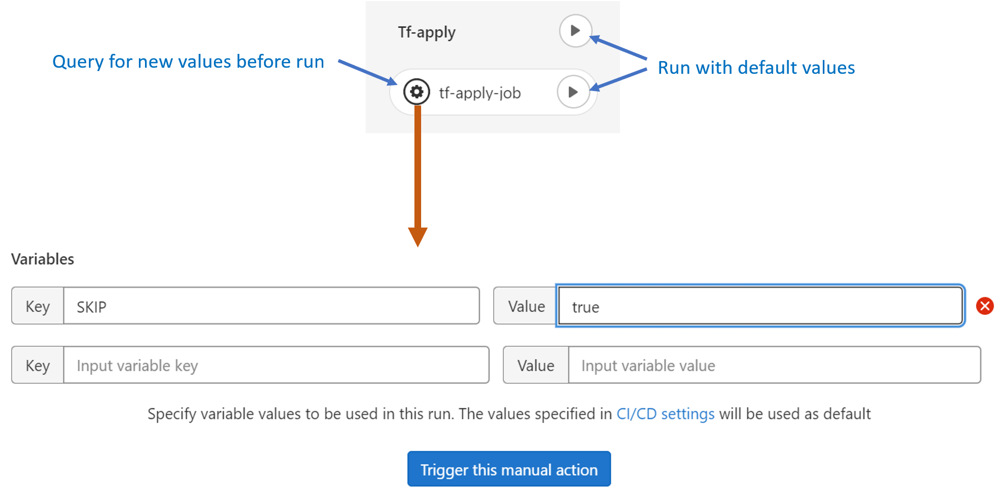

= image:img/vassblue.png[Vass logo] &nbsp;&nbsp;&nbsp; Project _cicd-librerias_
Faustino Nebrera <faustino.nebrera@vass.es>
1.0.3, 14/12/2022
:toc:
:toc-title: Index
:toclevels: 4
:sectnumlevels: 4
:icons: font

== Abstract

This project represents a fully operational example of a CI/CD chain built with the idea of simplifying the DevOps stack, the installation of required products and, above all, the preparation of pipelines and jobs for the most usual circuits. It is not intended to make product comparisons and, even less, to establish a strict guideline of how to do things, as each company and/or IT department has its own rules and regulations. For this reason, the libraries are
very flexible, and can be adapted with very little work to different regulations and procedures. 

Current version is specific to maven/java projects deployed as Docker stacks. Provisioning is
quite generic and is based on Terraform. For deploy, we have chosen to use bash and ssh, thinking in not too complex environments.

In later versions, we plan to replicate part of the libraries to include projects based on phyton, node.js, .Net.core, etc. It is also planned to incorporate the possibility of using some sophisticated deploy product, such as Ansible, Octopus, etc. Finally, work will be done on the provisioning and deployment of projects based on microservices (kubernetes, swarm, etc.).
 
== Versions

[cols=".<1,.<1,.<1,.<6", options="header"]
|===
|Vers
|By
|Date
|Notes

|1.0.0
|FNG
|22/08/2022
|First version for maven/java

|1.0.1
|FNG
|25/09/2022
|Added provisioning with Terraform and a generalized deploy using bash, sftp & ssh

|1.0.2
|FNG
|03/11/2022
|New facility for handling function libraries. New standar method to pass dynamic info from provisioning to deploy

|1.0.3
|FNG
|14/12/2022
|Documentation is now in english. New fully tested examples of provision/deploy: Currently available for Hyper-V, AWS & Vmware vSphere(TM)
|===

:sectnums:
== Introduction

The most common CI/CD stacks are composed of several products, each specialised in a particular aspect of the final solution pipeline.
It is very common to find stacks that include 6 or more different products: Gitlab, Jenkins, Sonar, Nexus, Vault, Octopus, etc.

It is clear that installing (and especially configuring) many heterogeneous products is not a trivial job. Some vendors
allow this task to be simplified by pre-integrated solutions (e.g. RedHat OpenShift, CI/CD services from Amazon Web Services or Azure, etc.), but of course these are not simple black-boxes, as each organisation
has its own CI/CD requirements. A small ISV is not the same as a large Financial Institution, which is why it is always necessary to
tinkering with the default configurations, or even creating them from scratch.

On the other hand, the _Jenkins(TM)_ type task coordinators are configured using a programming language that, although simple, requires DevOps engineers to have some
programming skills and familiarity with the language in question. If, in addition (and this is the norm), the code must be
kept read-only for the developers, and it must be modular (using libraries), so the learning curve is usually expensive.

In this project we have tried to minimise:

- The number of products involved.
- The complexity of defining task flows (pipelines).

For this purpose, some of the CI/CD capabilities offered by Gitlab in its latest versions have been used, and some example
pipelines have been defined and tested in a real environment, with quite satisfactory results.

[TIP]
.*Important*
--
Regardless of your previous CI/CD background, you may find it useful to read this document in order to reinforce
basic concepts and understand the philosophy of CI/CD pipelines.
--

== Developer's environment

=== Base Hardware & software

Server for Hyper-V::
* AMD Ryzen 7 5700G (8 cores, 16 threads).
* 64 GB Memory
* 1 TB SSD
* Windows Server 2022 Standard
* Hyper-V

Server for Vmware::
* Intel i7 7567U (4 cores, 4 threads).
* 32 GB Memory
* 256 GB SSD + 256 GB HD
* ESXi 8.0
* vCencer server 8.0

Server for CI/CD::
* Virtual machine on Hyper-V.
* 24 GB Memory max.
* 4 virtual processors.
* Ubuntu 22.04.1
* Docker 20.10.17 & docker-compose

Provisioned VMs::
* 2 GB Memory.
* 2 virtual processors.
* Alpine Linux 3.16.2 (Hyper-V). Amazon linux 2 (AWS). Debian bullseye 11.5 (Vmware)
* Docker 20.10.17 & docker-compose.
* Basic tools: OpenSSH-server, bash, sudo, etc.

=== CI/CD products

All products have been installed on the CI/CD server as docker images, and are launched via docker-compose, to make it easier to start/stop a particular product without affecting the rest. All docker-compose,s refer to a common bridge network.
By sharing the network, communication between containers is facilitated, since Docker acts as an internal DNS.
Except in the case of Nginx, no TCP/IP ports are exposed to the outside. External access is
channeled through Nginx (port 443), which acts as a reverse proxy, discriminating access based on the destination hostname. The
products installed are:

- Gitlab OMNIBUS 15.2.1-ce.0
- Gitlab-runner: latest
- Sonarqube 9.6.1-community
- PostgreSQL 14.4 (used by Sonar & Selfweb)
- Nginx 1.21.6 (reverse proxy)
- Portainer ce:2.15.1 (Docker monitoring)

== Solution overview

=== Working projects

Pipeline and job libraries are located in the "cicd-libraries" project, and will be described in more detail later. Both the libraries and the documentation are available in a public repository (github).

For a live working project, the Comunytek Selfweb application has been chosen, and specifically the REST server (selfwebspingboot). It is a java application that uses the SpringBoot framework. Maven is used as project manager. In the "cfg_examples"
folder you can see the pom.xml of this project, as well as other examples of configuration files.

=== Continuous integration model

The simplified "Git Flow" model has been chosen as the standard. While pipelines can easily be adapted to other models, this is the one preferred by many organisations, and the one currently used in the Comunytek Clan projects. The model works as follows:

image::img/gitflow.png[Git Flow]

- There must be a "master" branch, which is also the default branch. This branch must contain the code of the latest version released for production, or in the process of being released. The branch is protected so that only mantainers can do merge and push.
- There must be a "develop" branch. This branch must contain the code of the latest version released for pre-production, UAT, Staging, etc. or in the process of being released. The branch is protected so that only mantainers can do merge and push.
- Development is carried out on auxiliary branches, associated with all the development work prior to pre-deployment: to a feature, a developer, etc. Developers work locally on their branch and periodically push it for backup purposes, which can optionally trigger a CI/CD pipeline.
- As the development work on the different branches is completed,
they are unified by merge on a temporary branch (e.g. "desa-5.0.9-sprint-34") where possible inconsistencies are checked, integration and EndToEnd tests are carried out, etc.
- Once the temporary development branch is complete, a mantainer will merge locally over develop, resolve any last-minute inconsistencies and push develop, which will trigger a CI/CD pipeline associated with pre-production.
- When a SNAPSHOT is authorised for production, a "Mantainer" will do a local merge of 'develop' over 'master',
will modify the version in the pom (removing the string "SNAPSHOT"), and do master push, which will trigger a CI/CD pipeline associated to production. 
- Hotfix branches may exist, but no more than one at a time. As we will see later, this branch (if it exists) has special treatment.

=== Gitlab as a CI/CD environment

The latest versions of Gitlab incorporate a set of features that make it a good candidate to support the bulk of CI/CD chains in an integrated way. In the following sections we will discuss this subject in detail.

==== Source code repository

Git/Gitlab are the de-facto standard for source code management. We will not go into the details of Git, being it a well known fellow of every developer. However, there are some lesser-known features
that are worth mentioning.

- Gitlab includes a simple but quite complete *Issue Manager*, which, in some cases, can be used as a substitute for _Jira_(TM).
- It also includes a *Wiki* with support for several markup languages which, as in the previous case, can be used as a replacement for _Confluence_(TM), at least in terms of project documentation.

==== CI/CD Coordinator

Gitlab includes a relatively less-known CI/CD coordinator, whose capabilities have traditionally been despised in front of mainstream products, such as _Jenkins_(TM) or _TeamCity_(TM). In its latest versions, however, Gitlab has positioned itself as a serious competitor, mainly because of the following reasons:

* All CI/CD plumbing is tightly integrated with the source code repository, uses the same user interface,
and simplifies the eventual integration of other products.

* Pipelines are defined using a well-known markup language (yaml), avoiding the need of learning a specific language.

* Whenever complex actions are required, the shell environment is directly integrated with the job code. It is also very easy to create function libraries written in .sh, .bash, etc. and call them directly from a job. DevOps engineers can concentrate on creating the basis of the pipelines, leaving certain implementation details of each job to specialised developers.

==== Code Quality Control

Gitlab does not have a propietary solution for this subject. Instead, it proposes the of _CodeClimate(TM)_ product. Integration is currently in Beta phase. As far as the de facto standard for this phase has been, for years, _SonarQube(TM)_, which is also easily integrated with the most common project managers (maven, gradle, npm...), we have preferred to integrate this product in this example. The process is explained in detail later on.

==== Unit tests

Again, Gitab relies on third-party solutions for both unit testing and SAST execution. In our case, we will use the capabilities embedded in _maven_, which are more than sufficient in most projects.

==== Artifacts Building

Most project managers (_maven_, _gradle_, _npm_...) have their own mechanisms for detecting dependencies and building the final artifact(s). In this project we have relied on the capabilities of _maven_, as we will see later. Adapting the jobs to other environments is quite simple.

==== Artifacts Registry

In this aspect, the market is clearly dominated by two key players: _Nexus(TM)_ and _Artifactory(TM)_. Gitlab, however, provides a "Package Registry" compatible with most common formats, and with basic functionalities, which we think may be sufficient in many cases. For this reason, we have relied on Gitlab itself in this section.

==== Docker Image Registry

Gitlab provides a very flexible "Component Registry", so we have selected using it in this example. Note that Nexus, for example, incorporates this functionality as a separate product, not included in the Nexus Registry, which gose against our idea of simplicity.

==== Provisioning

For this subject, Gitlab propose the usage of docker images with Git + Terraform, facilitating the integration of _Terraform(TM)_ into gitlab pipelines. The aforementioned images include an integration library with 'gitlab-terraform xxxx' commands. We do not recommend the use of this library, as it adds little features and is somewhat cumbersome. Therefore, an ad-hoc docker image has been created based on a minimal linux (Alpine), and Terraform's native commands are used.

A very interesting aspect is that Gitlab can act as a backend to the Terraform status of the project, thus preventing simultaneous access from causing unwanted behaviour. 

==== Deployment

For this first version, deployment of the generated Docker image is done in a relatively simple way (using bash, sftp and ssh).
Gitlab can integrate different auxiliary platforms such as Helmet/Kubernetes, Ansible, etc., so later versions of this project will explore these possibilities. 

=== Gitlab CI/CD first steps

Obviously, it is not the purpose of this document explaining in detail how to work with Gitlab CI/CD, but it is interesting to comment on the main aspects.

- The first thing that surprises when approaching Gitlab CI/CD is that there is a *single* pipeline definition file per project. This file must be located at the root of the project, and must be named ".gitlab-ci.yml". The
file format is yaml, with fairly easy to learn keywords.
- Notwithstanding the above, this .yml can contain includes from other .yml file(s), which in turn can have includes, and so on.
In addition, includes can reference another project, so it is easy to set up a specific project to store these includes,
as is the case in this example.
- The pipeline is composed of stages, and job definitions associated to the different stages. There can be more than one job associated to a stage, either to be executed in parallel or just one of them depending on the values of certain variables.

image::img/stages.png[Gitlab Stages]

- There are two optional predefined stages, called ".pre" and ".post". The jobs defined for these stages will always be executed before (after) the rest of the stages.
- In each job, rules are defined to include or not this job in the pipeline, and under which execution conditions. For example, a "manual" job will be blocked in the pipeline until it is triggered by a Mantainer.
- When a CI/CD event is triggered, Gitlab parses all the rules and dynamically assembles a pipeline containing only the jobs where the rules are met. This allows us to have "n" different pipelines, each one associated to a set of rules. As you can see, this is a very different way of working as compared to _Jenkins(TM)_ or _Artifactory(TM)_.
- Using rules, we can define whether or not do we allow the job to fail and, consequently, the pipeline to continue. For example, in a job running Sonar, we allow it to fail in the "develop" branch, as it is not a release to production.
- We can include a "before_script" and an "after_script" in the job, in addition to the main script. For example, we can define an after_script that should be executed only if the job fails, to rollout or prepare for a later phase.
- In gitlab we must have one or more runners that manage the execution of the jobs, launching a specific executor for each one. In this example, we have configured a Docker runner, which runs as a separate Gitlab container. This runner, in turn, and for each job assigned to it, creates a Docker container with the image indicated in the job itself, and it is in this container where the scripts are executed. Scripts are written in the shell language associated with the docker image, i.e., "sh", "bash", "PowerShell", etc.

- For this example we have prepared an executor image called "ck-maven-executor", based on a lightweight linux distro (Alpine) on which maven, git and other utility modules are pre-installed. This way, we "save" all the time required to install these components every time we run a job. Additionally, another executor image called "ck-terraform-executor" has been prepared, also based on Alpine and with Terraform pre-installed. The directory "ejemplos_cfg/executors" contains
the Dockerfiles and shell scripts used to build these images.
- Gitlab has several mechanisms to "pass" information from one job to another. Possibly the most widely used is the "cache", in which we can include one or more working directories that each job "reads" at startup and "writes" at the end. A typical example of use is the maven dependency repository. If a required item
it is in cache, they will be downloaded only once and will be available to the different jobs later on.
- A key element in the definition of the pipeline are the "variables". In Gitlab, there are several levels of variables:
* Gitlab predefined variables: They all start with "CI_" and can contain both static and dynamic information. For example, CI_PROJECT_ID
contains the project Id (static), while CI_COMMIT_REF_NAME contains the name of the branch the pipeline is working on (dynamic).
* Group Variables: These are defined in the project group configuration. They can be masked, so that they are not visible in logs (e.g. passwords). As they are associated to the group, only "Mantainer" level users in the group have the right to view and modify them. Although this is a fairly simple mechanism, it allows us to avoid the need of a secrets manager (e.g. Vault) in the CI/CD phases.
* Project Variables: Similar to the previous ones, but project specific.
* Pipeline Variables: These are associated with the project pipeline and are modifiable by both Mantainers and Developers. They can be defined in any of the includes, or in the main .yml.
* Job Variables: These are specific to each job, and are valid only during the execution of that job.
* Environment Variables: Specific to each script. These are normally job variables, although it is possible to pass them to subsequent jobs using the "dotenv" artifact passing mechanism discussed later.
- The pipeline is triggered when certain events occur (commit, push, merge_request). Both at pipeline level and individually per job we can "filter" the events we are interested in. In this example, in the rules at pipeline level we have defined that we are only interested in "push" events.
- Gitlab has many other mechanisms (multi-project pipelines, external triggers, webhooks, etc.) that have not been necessary in this example, so we do not go into their description. 

== Library description

In this first version of the project, we use only three products: Gitlab, SonarQube and Terraform. This contrasts with the 4, 5 or 6 products that are commonly used in CI/CD chains. These three products are also very familiar to DevOps engineers and developers alike.

The project also demonstrates that Gitlab CI/CD can perfectly replace Jenkins or TeamCity, and with a very simple pipeline definition language and a fast learning curve.

=== Layout

A Git project called "cicd-libraries" has been created within the "comunytek" project group. In this group also lives the project "selfwebspringboot" which we will use as an example of the implementation of the libraries.

- 3 folders have been created in _cicd-libraries_:

* ejemplos_cfg: Includes examples of configurations in the base projects, such as ".gitlab-ci.yml", "pom.xml", etc.
* pipelines: Contains the main includes for the different environments. In the current version only those used for maven/java are defined.
* jobs: Contains a folder for each environment (in this example, only maven), and in each folder, the includes for each job in the pipeline.

- In _selfwebspringboot_ the file ".gitlab-ci.yml" has been created, as an example of integration of the _cicd-libraries_ libraries.

This is be the basic scheme for the use of libraries:

image::img/layout.png[Layout]

=== Variables

==== De Grupo

A nivel del grupo de proyectos (en este caso "comunytek") es necesario definir las siguientes variables:

CICD_USER:: Usuario de gitlab con suficientes derechos para llamar a la API de Gitlab en relación al proyecto. Normalmente será un Mantainer.
CICD_PASSWD:: Password del usuario anterior.
CICD_TOKEN:: Personal token creado para el usuario anterior (en settings de usuario).
CICD_EMAIL:: Dirección de correo del usuario anterior.
CICD_HOST:: Nombre del host donde se encuentra instalado Gitlab (p.e. "git2.comunytek.com").
CICD_REGISTRY_HOST:: Nombre del host para el acceso al registry Docker. Aunque se trata del propio Gitlab, atiende a un puerto distinto, por lo que hemos de discriminarlo por el nombre del host (p.e. "https://registry2.comunytek.com").
SONAR_HOST_URL:: Url completa del host donde está instalado Sonarqube (p.e. "https://sonar2.comunytek.com").
SONAR_HOST_TOKEN:: Token generado en Sonar para acceso externo mediante la API.

==== De pipeline (ocultas)

En el include principal del pipeline se definen un conjunto de variables que quedan ocultas para los Developers, y que se han utilizado como base para implementar los diferentes flujos. Un Manager de Grupo puede modificar el comportamiento del pipeline sin más que actualizar estas variables.

IGNORE_AUX_BRANCHES:: No ejecutar el pipeline en ramas auxiliares (aquellas distintas de 'master' y 'develop').
Si se define a "true", el resto de flags relacionados con ramas auxiliares no tienen efecto.
Como excepcion, la rama identificada como HOTFIX_BRANCH (si existe) siempre pasa.
COMPILE_AUX_BRANCHES:: Compilar o no ante un push en ramas auxiliares.
SONAR_AUX_BRANCHES:: Pasar o no Sonar en ramas auxiliares. En cualquier caso se admite que falle.
TEST_AUX_BRANCHES:: Pasar o no test unitarios en ramas auxiliares. En cualquier caso se admite que falle.
ALLOW_FAILURE_IN_SONAR_DEVELOP:: Permitir fallo al pasar Sonar en rama develop.
ALLOW_FAILURE_IN_TEST_DEVELOP:: Permitir fallo al pasar tests unitarios en rama develop.
ALLOW_RELEASE_IN_DEVELOP:: Permitir versiones release (no son SNAPSHOT) en rama develop. Normalmente será "false", pero puede haber circunstancias específicas en que sea necesario permitirlo. Nótese que nunca permitimos versiones SNAPSHOT en rama master.
REGISTER_DEVELOP:: Registrar, generar imagen docker y tag de la rama 'develop'. Debe indicarse a "true"
si la rama 'develop' representa despliegues oficiales en preproducción, UAT, QA o staging.
Si se establece como "false", el pipeline termina con la generación del fat-jar y su
almacenamiento temporal como artefacto.
PROVISION_DEVELOP:: Provisionar infraestructura (Terraform) en rama develop.
DEPLOY_DEVELOP:: Instalar/actualizar software en rama develop.
TF_BACKEND_ADDRESS:: URL del backend de Terraform (sólo aplica si se ha activado el provisioning con Terraform). Normalmente será "${CI_API_V4_URL}/projects/${CI_PROJECT_ID}/terraform/state/${CI_COMMIT_REF_NAME}".

==== Del proyecto

Se trata de variables con valores específicos para cada proyecto, pero que sólo deben ser editables por usuarios de nivel "Mantainer". Se definen en los settings CI/CD del proyecto.

===== Específicas para provisionado con Terraform 

TF_ROOT:: Directorio raiz de la configuracion de Terraform. Normalmente se definirá en base a variables intrínsecas de Gitlab. P.e "$CI_PROJECT_DIR/terraform/$CI_COMMIT_REF_NAME". 
TF_VAR_HYPERVISOR_USER:: Usuario de login del host donde reside el hipervisor. En el caso de AWS, Access key ID.
TF_VAR_HYPERVISOR_PASSWD:: Password de dicho usuario. En el caso de AWS, Secret acess key.

===== Específicas para despliegue como stack Docker

DEPLOY_SSH_USER:: Usuario a emplear para conectar por SSH con la VM creada
DEPLOY_SSH_KEY:: Variable tipo 'File' que contiene la clave privada para acceder por SSH a la nueva VM
DEPLOY_SSH_PATH:: Path donde vamos a instalar/actualizar el producto
DEPLOY_SSH_SVC_NAME:: Nombre del servicio docker que vamos a crear/instalar

==== De pipeline (editables)

Se trata de variables definidas en el ".gitlab-ci.yml" del proyecto y que son, por tanto, editables por los Developers, para tratar circunstancias específicas.

SNAPSHOT_NUMBER:: Si registramos, creamos docker y tag, etc. en SNAPSHOT podemos agregar (opcionalmente)
un numero de snapshot a la vesion del proyecto para identificar registros y tag. Nótese que, si la versión en el pom junto con este indentificador ya está registrada, el job de registro terminará con error, y el pipeline se interrumpirá.
HOTFIX_BRANCH:: Indicar la rama de hotfix en la que estamos trabajando, si es que existe. En esta rama, se ejecuta todo el pipeline,
aunque las etapas sonar y test admiten errores.
Comentar esta linea, o dejar en blanco el valor, una vez liberado el hotfix.
HOTFIX_NUMBER:: Opcionalmente, podemos indicar un numero de hotfix, para registro, docker y tag.
En la version del proyecto, se respeta la que se indica en el pom.xml.
RUN_CI_STAGES:: "true"/"false". Indica si se deben ejecutar las etapas asociadas a integración continua (CI).
RUN_REGISTER_STAGES:: "true"/"false". Indica si se deben ejecutar las etapas asociadas al registro de artefactos, imágenes docker y tags.
RUN_PROVISION_STAGES:: "true"/"false". Indica si se deben ejecutar las etapas asociadas al provisioning de infraestructura.
RUN_DEPLOY_STAGES:: "true"/"false". Indica si se deben ejecutar las etapas asociadas al despliegue (instalación/actualización) del software.

=== Pipeline del proyecto e include principal

En el proyecto _selfwebspringboot_ se ha creado el archivo ".gitlab-ci.yml" con el contenido siguiente:

------------------------------------------------------------
variables:
  SNAPSHOT_NUMBER: "005"
  HOTFIX_BRANCH: ""
  HOTFIX_NUMBER: "002"
  ....

include:
   project: 'comunytek/cicd-librerias'
   ref: master
   file: 'pipelines/maven-springboot-simple.yml'
------------------------------------------------------------

Como puede verse, simplemente se definen las variables de pipeline editables, y se incluye el resto de la definición del pipeline tomada del proyecto _cicd-librerias_.

El include principal sólo es editable por Managers de Grupo. En este ejemplo, mostramos a continuación un extracto de su contenido.

------------------------------------------------------------
variables:
  SONAR_USER_HOME: "${CI_PROJECT_DIR}/.sonar"    # Home de sonar, para caching
  ...

workflow:
  rules:
    - if: $CI_COMMIT_TAG        # No ejecutar en tags                   
      when: never
  ...

image: ck-maven-executor:1.0.1     # Imagen por defecto

cache:
  key: "$CI_COMMIT_REF_NAME"

# Etapas posibles del pipeline
stages:
  - prepare
  - compile
  
  ...
# Includes, uno por job
include: 
  - project: 'comunytek/cicd-librerias'
    ref: master
    file: 
      - 'jobs/maven/prepare-simple.yml'
      - 'jobs/maven/compile-simple.yml'
      ... resto de includes
------------------------------------------------------------

=== Fases del pipeline

A efectos de control global del flujo, se han agrupado las diferentes etapas en la siguientes fases:

* Preparación
- create-bash-library
- prepare
* Integración continua (CI)
- compile
- sonar
- test
- build
* Registro (artefacto, imagen docker, tag)
- register
- docker
- tag
* Aprovisionamiento de infraestructura
- tf-prepare
- tf-apply
* Despliegue del producto
- deploy

=== Jobs específicos para maven

A continuación se explica brevemente la funcionalidad de los diferentes jobs. Puede accederse al código fuente siguiendo el correspondiente link. Los jobs se muestran agregados por fases e indicando, si es necesario, la etapa (stage) a la que corresponden. 

==== Fase de preparación

Se ejecuta de manera incondicional, y se emplea para preparar la caché, así como algunas variables de entorno que serán de utilidad en etapas posteriores.

===== _Create-bash-library (.pre)_

Job definido en link:jobs/maven/create-bash-library.yml[]. Se ejecuta en la etapa ".pre", es decir, con anterioridad a cualquier otro job del pipeline. En este caso concreto, se limita a crear y popular un archivo temporal llamado "funciones-bash.sh" conteniendo una serie de funciones escritas en bash y de uso general para cualquier job del pipeline. El archivo generado se pasa como artefacto al resto del pipeline. Cuando un job quiere llamar a una función de la librería, necesita "cargarla" previamente, lo que se hace habitualmente en el before_script:

------------------------------------------------------------
  before_script:
    - . funciones-bash.sh
------------------------------------------------------------

Este mecanismo permite mantener la/s librería/s bajo control de código fuente, y es el recomendado por Gitlab (ver link:https://www.youtube.com/watch?v=sF3kPJTy2UU[]).

Idéntico mecanismo puede ser válido para librerías escritas en PowerShell, Python, Ruby, etc.

===== _Prepare (prepare)_

Para esta etapa se ha definido el job en el archivo link:jobs/maven/prepare-simple.yml[]. Este job se ejecuta incondicionalmente en todas las
ramas al hacer push, excepto en ramas auxiliares si el flag IGNORE_AUX_BRANCHES está a true (todo el pipeline simplemente se ignora). El job prepara el entorno para la ejecución de jobs posteriores.

- Define los directorios que forman parte del cache.
- Calcula una serie de variables de entorno, útiles para todo el pipeline.
- Copia las claves y valores de las variables de entorno a un archivo temporal "prepare.env".
- Pasa el contenido de "prepare.env" al resto del pipeline mediante un artefacto de tipo "reports" y clave "dotenv". Las variables contenidas en este archivo son accesibles en todo el pipeline.

==== Fase de integración contínua (CI)

===== _Compile_

El job en se define en link:jobs/maven/compile-simple.yml[]. Se ejecuta incondicionalmente en todas las ramas al hacer push, excepto en ramas auxiliares si el flag COMPILE_AUX_BRANCHES está a false (o bien el flag IGNORE_AUX_BRANCHES está a true, lo que aplica a todo el pipeline). También se ejecuta en la rama hotfix (si existe). En este ejemplo, el job es bastante simple:

- Define los directorios de la cache.
- Ejecuta "mvn clean compile". Si se produce un error de compilación, el pipeline se detiene.

===== _Sonar_

Para esta etapa se ha definido el job en el archivo link:jobs/maven/sonar-simple.yml[]. Se ejecuta incondicionalmente en todas las ramas al hacer push, excepto en ramas auxiliares si el flag SONAR_AUX_BRANCHES está a false. También se ejecuta en la rama hotfix (si existe). Se ejecuta Sonarqube sobre el código fuente para localizar bugs, code-smells y vulnerabilidades SAST.

- Se permite continuar en caso de error en hotfix y ramas auxiliares, así como en develop siempre que el flag ALLOW_FAILURE_IN_SONAR_DEVELOP se defina como true.
- En ramas auxiliares se pasa Sonar sólo en archivos modificados, mientras que en el resto de ramas se pasa a todo el código. 
- Se ejecuta "mvn validate sonar:sonar".

===== _Test_

Job definido en link:jobs/maven/test-simple.yml[]. Se ejecuta incondicionalmente en todas las ramas al hacer push, excepto en ramas auxiliares si el flag TEST_AUX_BRANCHES está a false. Nótese que en la rama hotfix (si existe) también se ejecuta este job. El objetivo del job es pasar los test unitarios definidos para el proyecto.

- Se permite continuar en caso de error en hotfix y ramas auxiliares, así como en develop siempre que el flag ALLOW_FAILURE_IN_TEST_DEVELOP se defina como true.
- Se ejecuta "mvn test".

===== _Build_

Para esta etapa se ha definido el job en el archivo link:jobs/maven/build-simple.yml[]. Este job se ejecuta incondicionalmente en master, develop y hotfix al hacer push. No se ejecuta en ramas auxiliares. Se trata de construir el artefacto objeto del proyecto. En el caso de maven/SpringBoot se trataría del llamado "fat-jar".

- Se ejecuta "mvn package". Si da error, se detiene el pipeline.
- Si estamos en la rama master y la versión del proyecto es SNAPSHOT, salimos con error 2 (no se permite SNAPSHOT en master).
- Si estamos en la rama develop, la versión del proyecto NO es SNAPSHOT y el flag "ALLOW_RELEASE_IN_DEVELOP" es false, salimos con error 3 (no se permite release en develop).
- Si estamos en develop y el flag REGISTER_DEVELOP es false, salimos con error 4 (la rama develop no se registra), con lo que detenemos el pipeline.
- Si salimos con error, generamos un artefacto compuesto por el fat-jar, el pom y el .gitlab-ci.yml. Este artefacto está disponible para su descarga durante un periodo de 8 horas. La idea es que, si se genera alguno de los errores anteriores, el pipeline se detenga, pero dispongamos del artefacto para pruebas adicionales, condiciones no contempladas, etc.

==== Fase de registro

===== _Register_

Job definido en link:jobs/maven/register-simple.yml[]. Se ejecuta en master, hotfix y develop (si el flag REGISTER_DEVELOP es true) al hacer push. No se ejecuta en ramas auxiliares. Este job asume que se ha ejecutado la etapa "build" y diponemos, por tanto, del "fat-jar" en la cache. Para que el job ejecute con éxito, se precisan unos requisitos previos:

- Habilitar (si no lo está) el "Package Registry" de Gitlab y configurarlo para que no acepte duplicados.
- Configurar, en el pom.xml, los registries para snapshot y release (dentro del elemento <distributionManagement>).
- Crear un archivo "ci_settings.xml" definiendo las credenciales de acceso a el/los registries.
- En el directorio "ejemplos_cfg/maven" pueden verse ejemplos para un proyecto real.

Este job (como otros varios del pipeline) se ha definido como "manual". Esto significa que queda bloqueado dentro de la cadena de ejecución hasta que se libere manualmente. En gitlab, no existe, por el momento, un mecanismo directo de interacción con la consola pero podemos, de forma indirecta, controlar el flujo:

Por ejemplo, en este caso, se ha definido una variable de job llamada SKIP, con valor inicial false. Si en el job pulsamos el icono de "play", la variable no cambiará su valor. Por contra, si pulsamos sobre el nombre del job, se nos presenta un formulario en el que podemos agregar o modificar el valor de variables locales.
En este ejemplo, podemos definir la variable SKIP a true, con lo que podemos, en el script, saltanos la ejecución de este job y pasar a la siguiente etapa:

-------------------------------------------------
  variables:
    SKIP: "false"
  script:
    - '[[ ${SKIP} == "true" ]] && { echo "WARN: Ha entrado SKIP=true, asi que saltamos esta etapa."; exit 0; }'

-------------------------------------------------

El job prepara un artifact ID del siguiente modo:

- En rama master, el ID es la versión del proyecto en el pom (debe ser de release). Como es lógico, no puede registrarse la misma versión más de una vez.
- En rama develop, y si es SNAPSHOT, se agrega a la versión del proyecto el valor de la variable SNAPSHOT_NUMBER, con lo quedaría algo como "5.0.6-SNAPSHOT.003". De este modo, podemos liberar para UAT o staging más de una versión intermedia, en forma de "release candidate", pero manteniendo registrada toda la historia de este SNAPSHOT.
- En rama develop, si NO es SNAPSHOT, y aceptamos release en develop (variable ALLOW_RELEASE_IN_DEVELOP a true), agregamos a la versión del proyecto la cadena "-DEVELOP-RELEASE" seguida del SNAPSHOT_NUMBER, es decir, algo como "5.0.6-DEVELOP-RELEASE.003". Es una situación bastante rara, puesto que se sale de la normativa básica de flujo, pero hemos dejado abierta esta posibilidad para acomodar circunstancias excepcionales.
- En rama hotfix (si existe), agregamos a la versión del proyecto la cadena "-HOTFIX" seguida del HOTFIX_NUMBER, es decir, algo como "5.0.6-HOTFIX.002".

Finalmente, creamos un tar con los fuentes y registramos un artefacto compuesto por el fat-jar, el pom y el tar:

----------------------------------------------------
      SRC_FILE="./{PRJ_VERS}-src.tgz"
      tar czf ${SRC_FILE} ./src/*
      mvn validate deploy:deploy-file -s ci_settings.xml \
      -Durl="${REG_URL}" \
      -DrepositoryId="gitlab-maven" \
      -Dfile="${JAR_FILE}" \
      -DpomFile="pom.xml" \
      ${VERSION} \
      -Dfiles=${SRC_FILE} \
      -Dclassifiers=src \
      -Dtypes=tgz
----------------------------------------------------

===== _Docker_

Para esta etapa se ha definido el job en el archivo link:jobs/maven/docker-simple.yml[]. Este job se ejecuta incondicionalmente en master y hotfix al hacer push. No se ejecuta en ramas auxiliares. Adicionalmente puede ejecutarse en develop si REGISTER_DEVELOP es true. Sólo se ejecuta si existe, en la raiz del proyecto, un archivo "Dockerfile".

El job prepara un Image ID del siguiente modo:

- En rama master, agregamos al Id base la cadena "/release". Nótese que el Component Registry SI admite duplicados.
- En rama develop, y si es SNAPSHOT, se agrega al Id base la cadena "/snapshot", y a la versión de proyecto el SNAPSHOT_NUMBER.
- En rama develop, si NO es SNAPSHOT, y aceptamos release en develop (variable ALLOW_RELEASE_IN_DEVELOP a true), agregamos al Id base cadena "/develop-release", y a la versión de proyecto el SNAPSHOT_NUMBER.
- En rama hotfix (si existe), agregamos al Id de base la cadena "/hotfix", y a la versión de proyecto el HOTFIX_NUMBER.

El job guarda el IMG_TAG generado en el archivo "prepare.env", y lo pasa como artefacto a etapas posteriores. Además:

- Crea la imagen Docker en base al Dockerfile.
- Hace login al Component Container de nuestro Gitlab.
- Registra la imagen mediante "docker push".

-------------------------------------------------
    - 'echo "IMG_TAG=${IMG_TAG}" >> prepare.env'
    - docker -v
    - 'echo "$CICD_PASSWD" | docker login -u $CICD_USER --password-stdin $CICD_REGISTRY_HOST'
    - docker build -t $IMG_TAG .
    - docker push $IMG_TAG 
-------------------------------------------------

===== _Tag_

Job definido en link:jobs/maven/tag-simple.yml[]. Se ejecuta en master, hotfix y develop (si el flag REGISTER_DEVELOP es true) al hacer push. El job se ha definido como "manual".

El job computa un TagID, de acuerdo los siguientes criterios:

- Si estamos en la rama master, el TagID se forma con la cadena "release-" seguida de la versión del proyecto, es decir, algo como "release-5.0.6".
- En rama develop, y si es SNAPSHOT, se forma con la cadena "snapshot-", la versión de proyecto y el SNAPSHOT_NUMBER. Algo como "snapshot-5.0.6-SNAPSHOT.003".
- En rama develop, si NO es SNAPSHOT, y aceptamos release en develop (variable ALLOW_RELEASE_IN_DEVELOP a true), se forma con cadena "develop-release-", la versión de proyecto y el SNAPSHOT_NUMBER. Algo como "develop-release-5.0.6.003".
- En rama hotfix (si existe), se forma con la cadena "hotfix-", la versión de proyecto y el HOTFIX_NUMBER. Algo como "hotfix-5.0.6.002".

Con este Id se genera un tag. Nótese que los TagID no pueden repetirse. 

-------------------------------------------------
    - git config user.name "$CICD_USER"
    - git config user.email "$CICD_EMAIL"
    - git remote remove origin
    - git remote add origin ${ORIGIN_URL}
    - git tag -a $TAG -m "Build $TAG"
    - git push origin $TAG
-------------------------------------------------

==== Fase de aprovisionamiento de infraestructura

En la versión actual de la librería se emplea Hashicorp _Terraform(TM)_ como gestor en la infraestructura. La librería es agnóstica en cuanto a la plataforma
de provisioning u otros detalles, que deberán definirse en archivos y módulos de Terraform. Para que el job funcione correctamente, en el proyecto debe
definirse una variable llamada TF_ROOT apuntando al directorio raiz de la configuración a emplear. Por ejemplo, si vamos a manejar infraestructura en Amazon AWS, y
queremos diferenciar las configuraciones de pre-producción y producción podríamos usar:

TF_ROOT=$CI_PROJECT_DIR/terraform/aws/$CI_COMMIT_REF_NAME

En el directorio _ejemplos-cfg_ pueden verse ejemplos de configuración para Hyper-V y AWS.

===== _Tf-prepare_

Se ha definido en link:jobs/maven/tf-prepare-simple.yml[]. Se ejecuta en master y, opcionalmente en develop, siempre que el flag PROVISION_DEVELOP esté a "true".

Se emplea como backend de estado el propio gitlab, para lo que se requiere establecer los datos de acceso al mismo mediante las variables TF_BACKEND_ADDRESS (debe definirse a nivel de grupo), TF_HYPERVISOR_USER y TF_HYPERVISOR_PASSWD (estas últimas a nivel de proyecto).

El job valida la configuración de terraform y crea el "plan" de provisionado en base a los posibles cambios sobre la situación real de máquinas, discos, interfaces, etc. El plan generado se pasa a las etapas posteriores en forma de artefacto interno del pipeline.

===== _Tf-apply_

Job definido en link:jobs/maven/tf-apply-simple.yml[]. Se ejecuta en master y, opcionalmente en develop, siempre que el flag PROVISION_DEVELOP esté a "true". Definido como "manual" para permitir la revisión detallada el plan preparado en la etapa anterior, antes de proceder al provisioning (apply). Como todos los jobs manuales de esta librería, podemos "saltarnos" la ejecución sin más que indicar SKIP=true antes de lanzarlo.

Adicionalmente, se ha previsto la posibilidad de realizar una acción cualquiera de terraform, para lo que debemos definir la variable ACTION con el valor deseado. Por defecto es "apply", pero podemos entrar "destroy" u otro comando terraform válido.

Con el fin de facilitar la posterior fase de despliegue, los _outputs_ de Terraform se escriben en un archivo llamado "cicd.vars", que se ha definido como parte de la caché, y tiene el formato "key=value", por lo que puede leerse fácilmente en forma de variables de entorno en etapas posteriores, sin más que emplear
"source cicd.vars" en el script. Al formar parte de la caché, se persiste entre una invocación y otra del pipeline. Por ejemplo, si uno de los outputs es la IP
de la máquina provisionada, se guardará en caché, con lo que podemos ejecutar el pipeline una vez con los flags
RUN_PROVISION_STAGES="true" y RUN_DEPLOY_STAGES="false" y, si todo ha ido bien, lanzar más tarde el pipeline con RUN_PROVISION_STAGES="false" y RUN_DEPLOY_STAGES="true",
y la/s etapa/s de deploy podrán obtener los outputs de Terraform desde el archivo cacheado _cicd.vars_. 

==== Fase de despliegue (instalación/actualización) del producto

===== _Deploy_

Para esta etapa se ha definido el job en el archivo link:jobs/maven/deploy-simple.yml[]. Se ejecuta en master y, opcionalmente en develop, siempre que el flag DEPLOY_DEVELOP esté a "true". Definido como "manual" para que pueda lanzarse sólamente una vez verificado que el provisionado ha sido correcto.

A fin de que la librería sea genérica, el job se ha planteado de manera muy simple:

- A nivel de proyecto, debe definirse una variable DEPLOY_ROOT apuntando a un directorio que contenga todo lo necesario para hacer el deploy. Por ejemplo:
DEPLOY_ROOT=$CI_PROJECT_DIR/deploy/$CI_COMMIT_REF_NAME.
- Tambien a nivel de proyecto deben definirse las variables DEPLOY_SSH_USER, DEPLOY_SSH_KEY, DEPLOY_SSH_PATH y DEPLOY_SSH_SVC_NAME, cuyo significado se ha explicado
en párrafos anteriores.
- En este directorio debe existir un archivo "exec_deploy.sh" conteniendo las funciones bash que se precisen y, obligatoriamente, una
denominada "exec_deploy", que será la que se ocupe de realizar el deploy propiamente dicho, ya sea simplemente con SSH o empleando algún agente externo,
tipo _ansible(TM)_ o similar.

En el ejemplo que venimos tratando, la función copia al remoto todo el directorio de deploy, que consiste en lo siguiente (ver directorio "deploy" en los ejemplos):

- Un archivo "docker-compose.yml" que define el stack docker en el que se ejecutará el producto. En este archivo hay un "placehorder" donde debemos indicar la imagen docker a instalar, que se habrá generado y registrado en la etapa "docker". Este placeholder se rellena mediante un archivo "docker-compose.override.yml" que se genera de manera automática en tiempo de despliegue, y que tendrá un contenido similar al siguiente:

-------------------------------------------------
services:
    selfweb:
        image: registry2.comunytek.com/comunytek/selfweb/selfwebspringboot/release:5.0.6
-------------------------------------------------

- Un árbol de directorios en los que definimos los "volumes" y "networks" que empleará el stack. Cuando alguno de los volúmenes se debe crear, pero no copiar su contenido al destino, debe incluir un archivo llamado "ignore". Si no es así, todo el contenido se copia (y sobrescribe) al destino (/var/lib/docker/volumes/xxx/_data).
- Un script bash llamado "deploy.sh" que se ejecutará de manera remota y se ocupará de realizar la instalación propiamente dicha (ver ejemplos).

== Casos de uso

Para los casos de uso que siguen, se parte de la siguiente configuración de variables:

*De pipeline (grupo)*

* IGNORE_AUX_BRANCHES: "false"
* COMPILE_AUX_BRANCHES: "true"
* SONAR_AUX_BRANCHES: "true"
* TEST_AUX_BRANCHES: "false"
* ALLOW_FAILURE_IN_SONAR_DEVELOP: "false"
* ALLOW_FAILURE_IN_TEST_DEVELOP: "false"
* ALLOW_RELEASE_IN_DEVELOP: "false"
* REGISTER_DEVELOP: "true"
* PROVISION_DEVELOP: "false"
* DEPLOY_DEVELOP: "false"

*De pipeline (proyecto)*

* SNAPSHOT_NUMBER: "003"
* HOTFIX_BRANCH: "Hotfix-Issue-23056"
* HOTFIX_NUMBER: "002"
* RUN_CI_STAGES: "true"
* RUN_REGISTER_STAGES: "true"
* RUN_PROVISION_STAGES: "true"
* RUN_DEPLOY_STAGES: "true"

=== Ramas auxiliares

Habitualmente un único desarrollador trabajará en la rama "X", en su PC personal, y con un repositorio git local clonado inicialmente desde el servidor Gitlab.

- Periódicamente, hará commit  de los cambios realizados a su repositorio local.
- Sea por razones de backup, por haber finalizado un sprint, etc., hará push de la rama auxiliar, lo que disparará el pipeline.
- Dado que IGNORE_AUX_BRANCHES es false, el pipeline se ejecuta, con los stages:
* create_bash_library: Comportamiento normal
* prepare: Comportamiento normal.
* compile: Se ejecuta, al ser COMPILE_AUX_BRANCHES = true.
* sonar: Se ejecuta, al ser SONAR_AUX_BRANCHES = true. Se pasa sonar sólo a los archivos modificados y se permite errores.
* NO se ejecuta la etapa test, al ser TEST_AUX_BRANCHES = false.

Como puede verse, se trata símplemente de verificar que el código fuente actual compila sin errores y pasa o no sonar.

=== Rama develop

El tratamiento de esta rama es bastante más complejo, puesto que en su desarrollo pueden intervenir varias personas. Además, si el flag REGISTER_DEVELOP es true, probablemente vamos a hacer un despliegue "oficial" a UAT o staging, por lo que hemos de ser cuidadosos.

- A medida que los desarrolladores van finalizando su trabajo en su rama "X, Y,..", hacen lo siguiente:
* Hacen fetch / diff / pull de la rama develop (o eventualmente de una rama temporal específica para el sprint), para obtener el último código disponible.
* Hacen merge (en local) de su rama "X" sobre develop/sprint. Si hay conflictos, deben resolverse en la rama "X" y repetir el proceso.
* Notifican al Project Leader que su trabajo está concluido, al menos provisionalmente.
* El proceso se repite hasta tener finalizada la versión o sprint, pasados los tests de integración y cualquier otro requisito previo y, en definitiva, poder pasar a pre-producción.

- El Project Leader, una vez finalizadas todas las ramas que conforman la versión o sprint, hace lo siguiente:
* Hace pull de develop a su repositorio local.
* Para cada una de las ramas auxiliares que conforman el SNAPSHOT (o bien para la rama de sprint) hace merge en local de dicha/s rama/s sobre develop. Si todavía quedan conflictos, deben resolverse entre los desarrolladores, y repetir el circuito.
* Una vez resueltos los conflictos, actualiza el pom de develop con la versión fijada para el SNAPSHOT. Si admitimos snapshots incrementales, se define el número de snapshot en la variable SNAPSHOT_NUMBER.
* Hace push de la rama develop, lo que dispara el pipeline.

- Con la configuración antes descrita, el pipeline funcionará del siguiente modo:

* create_bash_library: Comportamiento normal
* prepare: Comportamiento normal.
* compile: Comportamiento normal.
* sonar: Se pasa para todo el código, y NO se admiten errores (ALLOW_FAILURE_IN_SONAR_DEVELOP = false).
* test: Se pasan tests unitarios, y NO se admiten errores (ALLOW_FAILURE_IN_TEST_DEVELOP = false).
* build: Se crea el "fat-jar" y, posteriormente, se verifican condiciones para continuar el pipeline. Si no se cumplen, se genera un artefacto con el .jar y el pom, el cual queda disponible para download durante unas horas. Una de las condiciones para continuar es que REGISTER_DEVELOP valga true. Si, a pesar de estar en la rama develop, la versión del proyecto NO es SNAPSHOT, y dado que ALLOW_RELEASE_IN_SNAPSHOT es false, el pipeline se interrumpirá.
* register: Se registra un artefacto compuesto por el fat-jar, el pom y un tgz conteniendo los fuentes actuales en el "Package Registry" de gitlab. El Id del artefacto no puede repetirse, y así el artefacto se convierte en el "single source of truth" de las diferentes versiones registradas. En este ejemplo, al tratarse de un registro tipo maven, podría (si se tratase de una líbrería) emplearse como dependencia en otros proyectos.
* docker: Sólo si se trata de un proyecto docker. Se genera la imagen docker y se registra en el "Container Registry" de gitlab.
* tag: Se crea un nuevo Tag con Id único que incluye el SNAPSHOT_NUMBER.
* tf-prepare: NO se ejecuta (PROVISION_DEVELOP: "false").
* tf-apply: NO se ejecuta (PROVISION_DEVELOP: "false").
* deploy: NO se ejecuta (DEPLOY_DEVELOP: "false").

=== Rama master

En el modelo de flujo que hemos seleccionado, la rama master contiene únicamente la última versión para producción (release). Es por ello que el trabajo sobre esta rama es muy delicado, estando su manejo reservado a usuarios de nivel Mantainer y, preferentemente, al Project Leader.

- Una vez que último SNAPSHOT ha sido aprobado, el Project Leader hace lo siguiente:
* Hace pull de develop a su repositorio local, y se asegura de que se trata de la versión SNAPSHOT aprobada para producción.
* Para evitar errores, hace pull de master, y comprueba que se trata de la última versión de release.
* Hace merge de develop sobre master, y resuelve los eventuales conflictos con la ayuda del resto del equipo.
* Modifica la versión del proyecto en master para eliminar la cadena "-SNAPSHOT".
* Hace push de master, lo que dispara el pipeline.

- Con esta configuración, el pipeline funcionará del siguiente modo:

* create_bash_library: Comportamiento normal
* prepare: Comportamiento normal.
* compile: Comportamiento normal.
* sonar: Se pasa para todo el código, y NO se admiten errores.
* test: Se pasan tests unitarios, y NO se admiten errores.
* build: Se crea el "fat-jar" y, se verifica que la versión del proyecto NO es SNAPSHOT. Si no se cumple, se genera un artefacto con el .jar y el pom, el cual queda disponible para download durante unas horas y se interrumpe el pipeline.
* register: Se registra un artefacto compuesto por el fat-jar, el pom y un tgz conteniendo los fuentes actuales en el "Package Registry" de gitlab. El Id del artefacto no puede repetirse, y así el artefacto se convierte en el "single source of truth" de las diferentes versiones registradas. En este ejemplo, al tratarse de un registro tipo maven, podría (si se tratase de una líbrería) emplearse como dependencia en otros proyectos.
* docker: Sólo si se trata de un proyecto docker. Se genera la imagen docker y se registra en el "Container Registry" de gitlab.
* tag: Se crea un nuevo Tag con Id único (la versión del proyecto).
* tf-prepare: Inicializa el backend de terraform y crea el plan de provisioning.
* tf-apply: Se ejecuta de forma manual. Aplica el plan terraform anteriormente generado.
* deploy: Sólo si se trata de un proyecto docker. Se ejecuta de forma manual. Se instala o actualiza el producto en entorno de producción.

=== Rama hotfix

En esta versión se ha dejado bastante libertad al tratamiento de eventuales ramas hotfix, puesto que cada organización tiene su propia normativa, que deberá implementarse en la definición final del pipeline.

- Si es preciso crear y liberar un hotfix, se procederá del siguiente modo:
* El project leader creará, a partir del tag de la versión de release implicada, una nueva rama, designada de acuerdo con la normativa de la organización (p.e. "Issue-#"). Para que la nueva rama sea considerada hotfix, se modificará la variable HOTFIX_BRANCH para que contenga el nombre de dicha rama. El HOTFIX_NUMBER se definirá con un valor inicial, p.e. "001" que se deberá ir incrementando para cada hotfix requerido en la versión implicada.
* El desarrollo del parche se realizará bien en la propia rama de hotfix (si se trata de un trabajo de menor cuantía), o bien en una o más ramas auxiliares con las que después de hará merge sobre la de hotfix.
* Una vez finalizado el hotfix, se hará push de su rama, lo que disparará el pipeline.
* Nótese que, dependiendo de la normativa de la organización, los cambios realizados o bien se repetirán sobre el trabajo en curso en SNAPSHOT, o bien se incluirá la rama hotfix en una de las que se hará merge sobre develop antes de liberar el SNAPSHOT.
* Una vez finalizado el pipeline con éxito, lo normal es que se elimine la rama de hotfix.

- Con la configuración antes indicada, el pipeline funcionará del siguiente modo:

* create_bash_library: Comportamiento normal
* prepare: Comportamiento normal.
* compile: Comportamiento normal.
* sonar: Se pasa para todo el código, y SI se admiten errores.
* test: Se pasan tests unitarios, y SI se admiten errores.
* build: Se crea el "fat-jar" y no se hacen más comprobaciones.
* register: Se registra un artefacto compuesto por el fat-jar, el pom y un tgz conteniendo los fuentes actuales en el "Package Registry" de gitlab. El Id del artefacto no puede repetirse, por lo que a la versión del proyecto se agrega el HOTFIX_NUMBER, y el artefacto se convierte en el "single source of truth" de las diferentes versiones hotfix registradas. En este ejemplo, al tratarse de un registro tipo maven, podría (si se tratase de una líbrería) emplearse como dependencia en otros proyectos.
* docker: Sólo si se trata de un proyecto docker. Se genera la imagen docker y se registra en el "Container Registry" de gitlab.
* tag: NO se ejecuta.
* tf-prepare: NO se ejecuta.
* tf-apply: NO se ejecuta.
* deploy: NO se ejecuta.

== Conclusión

En el presente proyecto se ha comprobado que es posible obtener un ahorro importante, tanto en horas/hombre como en curva de aprendizaje, empleando Gitlab CI/CD como herramienta básica del proceso, frente a otras soluciones multi-producto, aunque, lógicamente, no se llegue al nivel de sofisticación y complejidad que pueden aportar las mismas. Adicionalmente, la definición de pipelines realizada, si bien es sólo un ejemplo, puede emplearse como "template" y adaptarse a los requisitos de muchas organizaciones.

Se han incorporado, además, etapas de provisionado y despliegue relativamente sofisticadas, empleando _Terraform(TM)_, ssh, sftp y bash, que son más que suficientes para muchas situaciones reales. 
